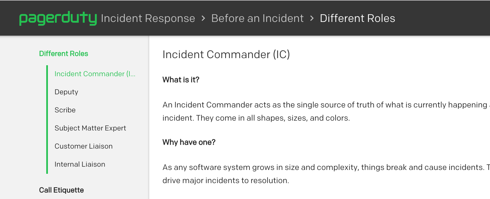

# PagerDuty Incident Response Documentation 

This is a public version of the Incident Response process used at PagerDuty. It is also used to prepare new employees for on-call responsibilities, and provides information not only on preparing for an incident, but also what to do during and after. See the [about page](docs/about.md) for more information on what this documentation is and why it exists.

You can view the documentation [directly](docs/index.md) in this repository, or rendered as a website at https://response.pagerduty.com.

## Development
We use [MkDocs](https://www.mkdocs.org/) to create a static site from this repository.

### Native
For local development on your native device,

1. Install [MkDocs](https://www.mkdocs.org/user-guide/installation/). `pip install mkdocs`
1. Install [MkDocs PyMdown Extensions](https://squidfunk.github.io/mkdocs-material/extensions/pymdown/). `pip install pymdown-extensions`
1. Install [Pygments](https://pygments.org/) if you want syntax highlighting for any code examples. `pip install pygments`
1. Install the [PagerDuty MkDocs Theme](https://github.com/pagerduty/mkdocs-theme-pagerduty).
    1. `git clone https://github.com/pagerduty/mkdocs-theme-pagerduty`
    1. `cd mkdocs-theme-pagerduty & python3 setup.py install`
1. To test locally, run `mkdocs serve` from the project directory.
1. You can now view the website in your browser at `http://127.0.0.1:8000`. The site will automatically update as you edit the code.

### Docker
For local development using Docker,

1. Build the docker image and load it for immediate use. `docker build --load -t mkdocs .`
1. Run the container and pass through your current working directory. `docker run -v $(pwd):/docs -p 127.0.0.1:8000:8000 mkdocs`
1. You can now view the website in your browser at `http://127.0.0.1:8000`. The site will automatically update as you edit the code.

_Note: If you're using an Apple Silicon device, add `--platform linux/arm64/v8` to the `docker build` command to get a native Apple Silicon image. That will work faster than translating an arm64 image._

## Deploying
1. Run `mkdocs build --clean` to produce the static site for upload.
1. Upload the `site` directory to S3 (or wherever you would like it to be hosted).

        aws s3 sync ./site/ s3://[BUCKET_NAME] \
          --acl public-read \
          --exclude "*.py*" \
          --delete

## License
[Apache 2](https://www.apache.org/licenses/LICENSE-2.0) (See [LICENSE](LICENSE) file)

## Contributing
Thank you for considering contributing! If you have any questions, just ask - or submit your issue or pull request anyway. The worst that can happen is we'll politely ask you to change something. We appreciate all friendly contributions.

Here is our preferred process for submitting a pull request,

1. Fork it ( https://github.com/PagerDuty/incident-response-docs/fork )
1. Create your feature branch (`git checkout -b my-new-feature`)
1. Commit your changes (`git commit -am 'Add some feature'`)
1. Push to the branch (`git push origin my-new-feature`)
1. Create a new Pull Request.
