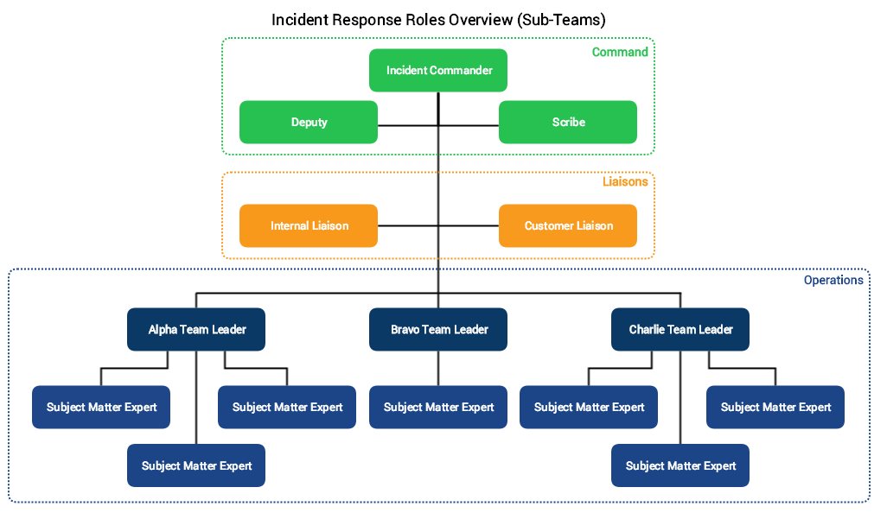

There will come a time when you will be involved in an incident (or multiple concurrent incidents) which ends up spanning a large number of resources. In these cases, it's important for everyone to maintain an effective [span of control](../training/glossary.md#span-of-control). This page describes how we manage such incidents.

## Identifying Complex Incidents
Perhaps multiple issues are happening at once, or an existing incident escalated and had a knock-on effect on other services. It's important to identify these types of incidents as early as possible to prevent confusion and burnout. Here are a few key things the Incident Commanders will be watching out for to help to identify a complex incident.

1. Are multiple teams involved?
    * Are most of them actively investigating multiple issues?

1. Multiple symptoms are present, and do not appear to have any obvious correlation.

1. A group of SME's are all working on the same analysis.

1. The incident calls "feels crowded." This is a rather fuzzy metric, but most people can generally get a feeling when there's too many responders on the call.

## Sub-Teams
When it is identified that we have a complex incident, the incident commander will spin off sub-teams to work on each individual problem. We have three predefined sub-teams, which the Incident Commander may assign you to: Alpha, Bravo, and Charlie. Each team has its own Slack room and conference call bridge already set up and ready for use.

!!! note "Team Names"
    We chose the phonetic alphabet for our teams. We did not use colors as "Red Team" and "Blue Team" have other definitions within security incident response, and we wanted to prevent confusion.

| | | |
|-|-|-|
| Alpha Team | #team-alpha | +1.555.123.4567 |
| Bravo Team | #team-bravo | +1.555.123.4568 |
| Charlie Team | #team-charlie | +1.555.123.4569 |

All three teams do not necessarily need to be active at the same time. An incident may call for only one, or even more than three if necessary. Team leaders will be picked and then assigned to a specific team designation by the Incident Commander.

### Role Structure
How do sub-teams fit into the role structure for our incident response? The team leaders essentially replace the SMEs in the normal role structure, and then the SMEs will report to their team leader. This ensures that the Incident Commander and team leaders can maintain an effective span of control.

### Spinning Off Sub-Teams

1. The IC will assign a leader to each team who will report to them directly. All other team members will report to their team leader.
    * When assigning a team leader, the IC will also designate which team name they fall under (Alpha, Bravo, or Charlie).
    * _Team leaders do not have to be trained as incident commanders; however, some leadership experience would be prudent._

1. Each team will be given a specific task to complete and will be time-boxed as they normally would for an individual responder.

How teams are split is at the discretion of the incident commander. Potential structures include:

* Cross-functional groups to address one entire problem domain per group.
* Groups of Subject Matter Experts to focus on one specific element of a larger problem.
* Teams based on normal day-to-day roles.

### Switching Sub-Teams
If you feel like you would be better suited on another sub-team, you should bring this up with your **current team leader**. Do not bring it up to the Incident Commander or with the leader of the team you wish to be on. An incident is currently in progress, and the defined escalation path should still be followed.
