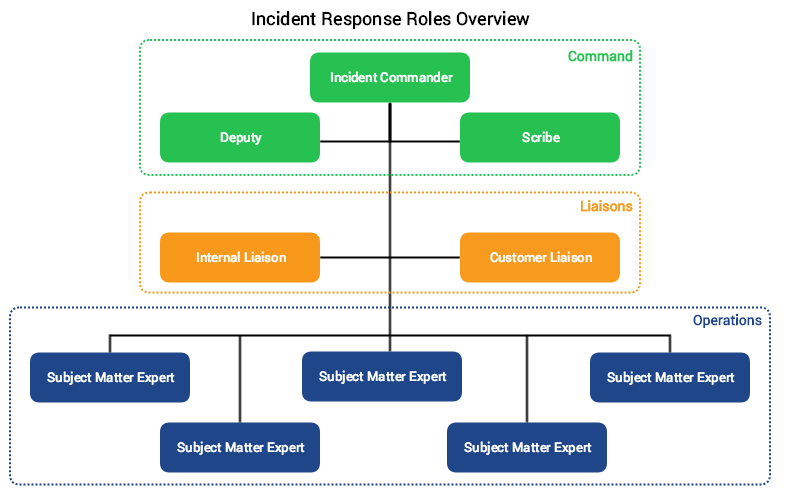

There are several main roles for our incident response teams at PagerDuty. Certain roles only have one person per incident (e.g. IC), whereas other roles can have multiple people (e.g. Subject Matter Expert, SME). It's all about coming together as a team, working the problem, and getting a solution quickly.

Here is a rough outline of our role hierarchy, with each role discussed in more detail on the rest of this page.

During larger complex incidents, the role structure may be adjusted to account for the creation of sub-teams. Read about how we handle [complex incidents](/before/complex_incidents.md) for more information.

!!! tip "Flexible Structure"
     It is not intended that every role be filled by a different person for every incident. For example, if the incident is small enough in scope, the Deputy might also take on the responsibilities of the Scribe and Internal Liaison for that specific incident. The structure should be flexible and scale based on the size and scope of the incident.

---

## Incident Commander (IC)

### What is it?
An Incident Commander acts as the single source of truth of what is currently happening and what is going to happen during an major incident. They come in all shapes, sizes, and colors.

### Why have one?
As any software system grows in size and complexity, things break and cause incidents. The Incident Commander is needed to help drive major incidents to resolution.

### What are the responsibilities?
1. Help prepare for major incidents,
    * Setup communications channels for major incidents.
    * Funnel people to these communications channels when there is a major incident.
    * Train team members on how to communicate during major incidents and train other Incident Commanders.
1. Drive major incidents to resolution,
    * Get everyone on the same communication channel.
    * Collect information from team members for their services/area of ownership status.
    * Collect proposed repair actions, then recommend repair actions to be taken.
    * Delegate all repair actions, the Incident Commander is NOT a resolver.
    * Be the single authority on system status
1. Post Mortem,
    * Creating the initial template right after the incident so people can put in their thoughts while fresh.
    * Assigning the post-mortem after the event is over, this can be done after the call.
    * Work with Team Leads/Managers on scheduling preventive actions.

### Who are they?
Anyone on the Incident Commander on-call schedule. Trainees are typically on the Incident Commander Shadow schedule.

### How can I become one?
Take a look at our [Incident Commander training guide](/training/incident_commander.md).

---

## Deputy

### What is it?
A Deputy is a direct support role for the Incident Commander. This is not a shadow where the person just observes, the Deputy is expected to perform important tasks during an incident.

### Why have one?
It's important for the IC to focus on the problem at hand, rather than worrying about documenting the steps or monitoring timers. The deputy helps to support the IC and keep them focussed on the incident.

### What are the responsibilities?
The Deputy is expected to:

1. Bring up issues to the Incident Commander that may otherwise not be addressed (keeping an eye on timers that have been started, circling back around to missed items from a roll call, etc).
1. Be a "hot standby" Incident Commander, should the primary need to either transition to a SME, or otherwise have to step away from the IC role.
1. Manage the incident call, and be prepared to remove people from the call if instructed by the Incident Commander.

### Who are they?
Any Incident Commander can act as a deputy. Deputies need to be trained as an Incident Commander as they may be required to take over command.

### How can I become one?
Take a look at our [Deputy training guide](/training/deputy.md). Deputies also need to be [trained as an Incident Commander](/training/incident_commander.md).

---

## Scribe

### What is it?
A Scribe documents the timeline of an incident as it progresses, and makes sure all important decisions and data are captured for later review.

### Why have one?
The incident commander will need to focus on the problem at hand, and the subject matter experts will need to focus on resolving the incident. It is important to capture a timeline of events as they happen so that they can be reviewed during the post-mortem to determine how well we performed, and so we can accurate determine any additional impact that we might not have noticed at the time.

### What are the responsibilities?
The Scribe is expected to:

1. Ensure the incident call is being recorded.
1. Note in Slack important data, events, and actions, as they happen. Specifically:
    * Key actions as they are taken (Example: "prod-server-387723 is being restarted to attempt to remove the stuck lock")
    * Status reports when one is provided by the IC (Example: "We are in SEV-1, service A is currently not processing events due to a stuck lock, X is restarting the app stack, next checkin in 3 minutes")
    * Any key callouts either during the call or at the ending review (Example: "Note: (Bob B) We should have a better way to determine stuck locks.")

### Who are they?
Anyone can act as a scribe during an incident, and are chosen by the Incident Commander at the start of the call. Typically the Deputy will act as the Scribe, but that doesn't necessarily need to happen, and for larger incidents may not be possible.

### How can I become one?
Follow our [Scribe training guide](/training/scribe.md), and then notify the Incident Commanders that you would like to be considered for scribing for the next incident.

---

## Subject Matter Expert

### What is it?
A Subject Matter Expert (SME), sometimes called a "Resolver", is a domain expert or designated owner of a component or service that is part of the PagerDuty software stack.

### Why have one?
The IC and deputy are not all-knowing super beings. When there is a problem with a service, an expert in that service is needed to be able to quickly help identify and fix issues.

### What are the responsibilities?
1. Being able to diagnose common problems with the service.
1. Being able to rapidly fix issues found during an incident.
1. Concise communication skills, specifically for CAN reports:
    * Condition: What is the current state of the service? Is it healthy or not?
    * Actions: What actions need to be taken if the service is not in a healthy state?
    * Needs: What support does the resolver need to perform an action?

### Who are they?
Anyone who is considered a "domain expert" can act as a resolver for an incident. Typically the service's primary on-call will act as the SME for that service.

### How can I become one?
Take a look at our [Subject Matter Expert training guide](/training/subject_matter_expert.md). You should also discuss with your team and service owner to determine what the requirements are for your particular service.

---

## Customer Liaison

### What is it?
A person responsible for interacting with customers, either directly, or via our public communication channels. Typically a member of the Customer Support team.

### Why have one?
All of the other roles will be actively working on identifying the cause and resolving the issue, we need a role which is focused purely on the customer interaction side of things so that it can be done properly, with the due care and attention it needs.

### What are the responsibilities?
1. Post any publicly facing messages regarding the incident (Twitter, StatusPage, etc).
1. Notify the IC of any customers reporting that they are affected by the incident.
1. Provide customers with the external message from the post-mortem once it is completed.

### Who are they?
Any member of the Support Team can act as a customer liaison.

### How can I become one?
Follow our [Customer Liaison training guide](/training/customer_liaison.md), and discuss with the Support Team about becoming our next Customer Liaison.

---

## Internal Liaison

### What is it?
A person responsible for interacting with internal stakeholders. Whether it's notifying an internal team of the incident, or mobilizing additional responders within the organization.

### Why have one?
For larger incidents, we may have multiple teams across the organization involved. Having a dedicated liaison to mobilize those teams and bring them up to speed free's up the rest of the responders to handle the incident.

### What are the responsibilities?
1. Page SME's or other on-call engineers as instructed by the Incident Commander.
1. Notify other teams within the organization (e.g. Finance, Legal, Marketing), as instructed by the Incident Commander.
1. Liaise with stakeholders and provide status updates as necessary.
1. Interact with internal stakeholders to answer their questions, to keep the primary call distraction free.

### Who are they?
Anyone designated by the Incident Commander during incident response.

### How can I become one?
Follow our [Internal Liaison training](/training/internal_liaison.md).
