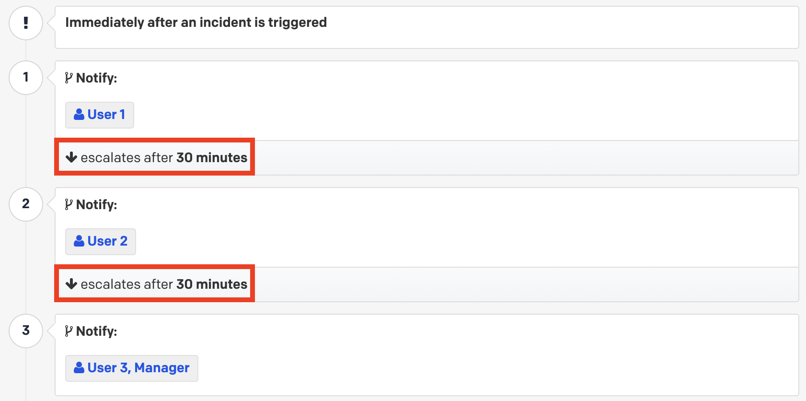
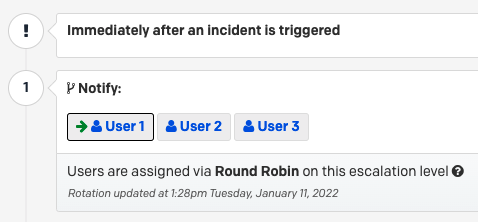

Effective crisis management requires leadership. Crisis Leadership underlines how your corporate leaders apply your organization’s values to all stages of a crisis.

## Why is Crisis Leadership important for your organization
With every crisis, there is danger and opportunity. The right kind of leadership is vital in the critical moments of your company’s history. The right kind of crisis leadership is values-driven and maintains the balancing act between carefully and thoughtfully responding to what went wrong and deliberately capturing mindshare or new business based on the effectiveness of your response. 

When your company’s values are at the forefront, your stakeholder communications and public statements remain consistent. Your audience can always tell when you’re backpedaling from established viewpoints or bandwagoning. You avoid compounding the situation by being consistent. No two crises are alike just as no two organizations are alike. Crisis Leadership centers on you—not others—telling your constituents your organization’s story from one crisis to the next.

## Considerations for Crisis Leaders 

The unpredictable and fluid nature of a crisis requires situational awareness. Being aware of what you know and don't know is crucial. Continually monitoring the situation, predicting statuses and being prepared to roll with the changing environment makes your company adept at crisis response and provides your team with purpose, i.e., everyone is in sync and working towards the same goal.

An increasingly important aspect of Crisis Leadership is taking care of yourself and your team. Members of your crisis response team may have been impacted by the events but are still working to resolve it. Some of your team may have been awake for 24 hours needing someone to give them permission to step away. Fatigue may be setting in and so forth. Leveraging the functionality built into the PagerDuty platform to establish on-call rotations, hand-offs and integrate video conferencing technology like Zoom or Teams can help create a safe and healthy [on call culture](https://goingoncall.pagerduty.com/culture/) for your teams while responding to what could be a protracted situation.

## Do's and Don'ts when Leading A Crisis
Successful and unsuccessful corporate responses to crises are all around us. In fact, the chances are high that there’s one of each happening in the news at the time you're reading this guide. What’s important is that you learn from the very public mistakes of others and develop your core principles in the form of a do's and don'ts list. Some of them may be obvious but they’re still worth documenting. Here are a few common examples:

- **DO** have a set of generic holding statements ready to go that can be easily customized for specific situations (e.g., vendor bankruptcy, cyber incident, product recall, high profile departure, etc.)

- **DO** be cautious about when and how you respond, as there is always a risk that the news could break before you’ve commented

- **DO** be measured in your response and avoid playing whack a mole trying to respond to every negative post, inquiry or attack

- **DON’T** assume multiple crises or incidents happening at the same time are related

- **DON’T** copy and paste—i.e., take actions that are unique to your organization’s values, history, and risk profile, and within your capabilities or you’ll risk greater exposure

- **DON’T** assume that making proactive non-obligatory public statements are not without great risk—you need to carefully weigh your decision with your Legal team in this regard

- **DON’T** assume that what you've said internally or to a subset of customers or investors won’t go public

## Crisis Scenario Planning

Crisis Leaders should always plan for the company’s worst day before it becomes a reality. If the 2020 pandemic was your first existential crisis, Murphy’s Law says it won’t be your last. It’s likely you’ll experience multiple crises during your tenure at an organization. Referencing your company’s historical crises while planning is one piece of the puzzle. However, scenario planning is forward-looking and hones in on the most likely and most damaging crisis scenarios for your organization to proactively develop teams, plans and playbooks. There are a myriad of scenarios to choose from but here are a few examples:

- Critical infrastructure attack (e.g., power, water, transportation)
- Cyber incident (e.g., ransomware, data breach)
- Pandemics (e.g., contagions)
- Environmental disaster (e.g., earthquake, hurricane, drought)
- Human resources crisis (e.g., union strikes, walk-outs, labor shortage)
- Geopolitical disaster (e.g., war, coup d’etat)
- Terrorism (e.g., political violence, sabotage)
- Economic disaster (e.g., stock market crash, currency crisis)
- Industrial accident (e.g., gas leak, building collapse)

If time was infinite and the world was static, you could plan for all of the scenarios in the world. However, the goal is to select a handful of scenarios from your list and build transferable principles and skills that prepare you for a wider range of crises. Another way to do that is by focusing on the consequences across your scenarios and solving for those capability gaps by adding controls such as playbooks, runbooks or predefined tactical response teams. You may also find that the order of criticality changes as the operating environment changes so periodic review of your top scenarios and the associated plans and teams is important.

## Assembling An Executive Crisis Leadership Team

Developing an Executive Crisis Leadership Team is a good starting point when considering the scope, scale and role of your Crisis Response team. This group will consist of functional business owners from all areas of your organization from Communications to Legal to Human Resources and so on. Consider starting with some or all of the following functional roles:

-   Chief Executive Officer
-   Chief Legal Officer
-   Chief Communications Officer
-   Chief Financial Officer
-   Chief Information Security Officer
-   Chief Human Resource Officer
-   Chief Operating Officer
-   Chief Information Officer
-   Chief Resilience Officer
-   Chief Revenue Officer
-   Chief Marketing Officer
-   Chief Security Officer

There’s no one size fits all and you may not need all of these roles in your Executive Crisis Leadership Team. It’s also important to consider your Board of Directors—if you have one—as an extension of your Executive Crisis Leadership Team. Similarly, external resources like Public Relations/Crisis Management firms, Disaster Recovery services, insurance providers, Digital Forensic Specialists or Local/Federal authorities should not be overlooked as essential contacts to document.

## Crisis Team Leaders

It’s important to put a face to a crisis. A Crisis Team Leader is the individual responsible for leading the organization through a crisis having overall responsibility based on their area(s) of expertise. They’re similar to an Incident Commander for a crisis situation. However, a Crisis Team Leader may function more as an Area Commander if there are multiple Incident Commanders to oversee in a complex situation. 

Once you’ve built your handful of scenarios, assigning members of your organization as the team leader along with their backup is the next step. See the below table as an example:

| **Crisis Scenario** | **Scenario Examples** | **Crisis Team Leader** | **Potential Backup** |
| ------------------- | --------------------- | ---------------------- | -------------------- |
| Critical infrastructure attack | Energy grid, water supply, telecommunications | Chief Operating Office | Logistics Chief |
| Environmental disaster | Earthquake, hurricane, volcano | Chief Resilience Officer | Safety Chief |
| Human resources crisis | Labor strike, protests, labor violation | Chief Human Resource Officer | Operations Chief |
| Marketing campaign failure | Typo, untrue product claim, wrong tone | Chief Digital Officer | Communications Chief |

Using PagerDuty, you can build your [on-call schedule](https://support.pagerduty.com/docs/schedule-basics) right inside the platform providing visibility and accountability about who’s on call for what area of the business if a crisis situation takes place. You can also add backups using an escalation policy that alerts the next person up after a custom time delay.

If you want to balance the load for your on-call team, the [round robin scheduling](https://support.pagerduty.com/docs/round-robin-scheduling) can help by alternating who’s the primary team member that’s notified for each crisis notification.

## Succession planning
As you examine the makeup of your Executive Crisis Leadership Team, Crisis Team Leaders and their backups, you should view it through the lens of succession planning or failover mapping. Depending on the makeup of your organization and geographical concentrations, you may want to further diversify your members to spread the risk. If everyone is positioned close together, an impact to that region will lead to failure and extended MTTRs. You will want your PagerDuty rotations and/or escalation policies to reflect this strategy.
