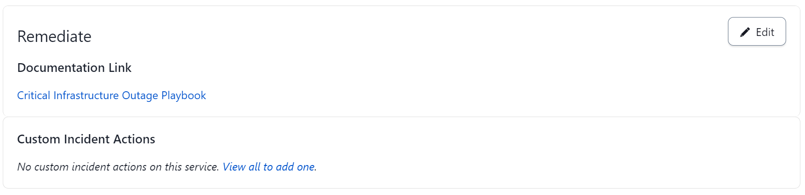
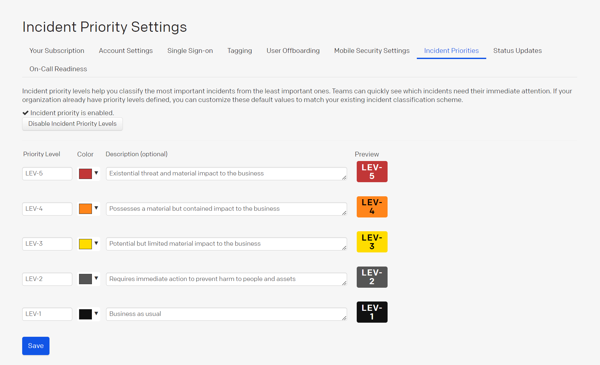
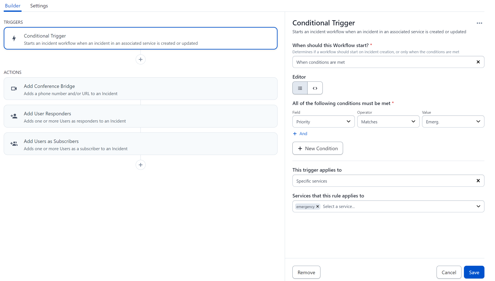
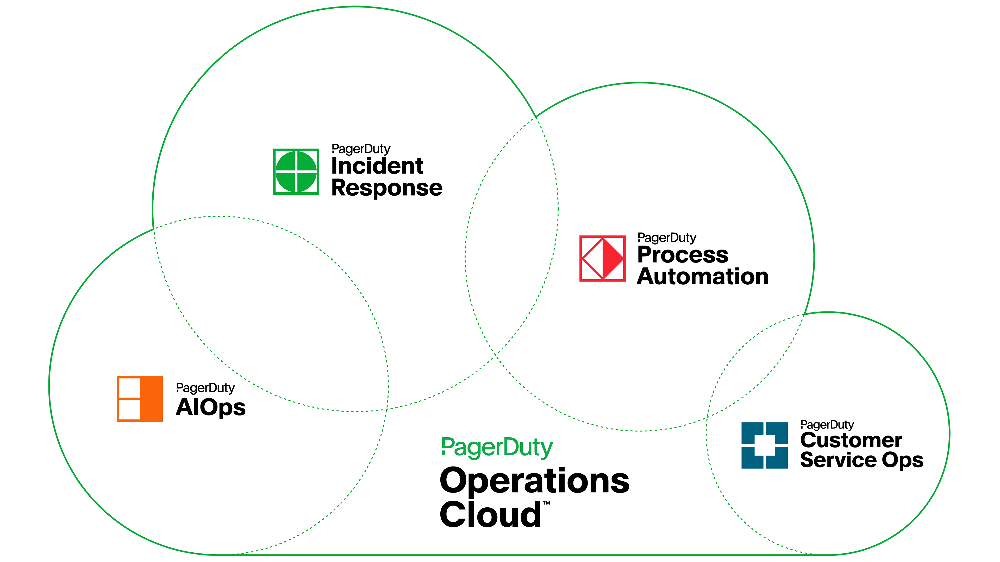

## Operationalizing Your Crisis Plan

Operationalizing your crisis plan begins by making practical changes to ensure you have what you need, in the way you need it, and at the time you need it. For example, your broader crisis management plan will be too cumbersome for your team to scan through for answers during a crisis situation. On the other hand, playbooks are more focused versions of your larger plan which make them easier to action, test and maintain. They’re also scenario-driven and provide you with specific parameters, considerations and tasks.

Once you have these critical resources created, it can be difficult to centralize them and keep track of the most current version. PagerDuty makes this easy with the ability to add your runbooks, playbooks, policies and any other crisis response [documentation links](https://support.pagerduty.com/docs/service-profile#remediate) into your PagerDuty defined service(s).

## Crisis Classification Scheme

Waking up your Executive Crisis Leadership Team in the middle of the night with a PagerDuty alert should be a very rare occurrence. Having a [classification scheme](https://support.pagerduty.com/docs/incident-priority#establish-an-incident-classification-scheme) in place to rank the actual or anticipated materiality of an event will help you avoid a cry wolf scenario. A simple scale such as Low, Medium, High or Level 1, 2, 3 can be effective.

WIthin PagerDuty, you can add your crisis “material impact levels” using the [incident priority](https://support.pagerduty.com/docs/incident-priority) feature. Remember that not all crises begin as a crisis. It may develop out of an ongoing incident so determining your thresholds for escalation ahead of time (e.g., 90 minutes without HVAC, 24 hours without direct contact, greater than $100k revenue at risk, etc.) is equally as important as the rankings.

Once you’ve defined your priorities, you can begin to leverage PagerDuty to automate parts of your crisis response through integrations and [incident workflows](https://support.pagerduty.com/docs/incident-workflows). You can integrate with Slack, Teams or Zoom for creating communications channels. You can auto-publish from templates or use our built-in Generative AI to post on internal status pages. You can auto-initiate stakeholder alerts or [subscriptions](https://support.pagerduty.com/docs/communicate-with-stakeholders#add-subscribers-at-incident-creation), etc. 

In a crisis situation, time savings are everything. Decreasing the mean time to respond and getting in touch with the right people is the most critical action your team can take at the onset of a crisis.

## Crisis Declaration

Does your crisis response team operate the same in a crisis as they do in normal business situations? Your answer should be no. Operating in a “crisis mode” should be distinctive because all actions and decisions are amplified, the tempo is quicker, the need for timely decisions is critical, the complexity of the problems are greater, the risks are higher, etc. 

The Crisis Team Leader needs to clearly and definitively signal that the modes of thinking and processing have shifted. What better way to signal that shift than through a PagerDuty alert. The incident priority feature is an easy way to make that declaration to the necessary stakeholders in a not so public way. Declaring the response as over is also important in transitioning to normal or new ways of doing things, which can be completed by [resolving the alert](https://support.pagerduty.com/docs/alerts#resolve-alerts) created on your crisis service(s) or posting to an internal status page.

## Crisis Response Management Operations

If you’ve followed along so far, you’ve essentially learned the ins and outs of a PagerDuty instance for crisis response. During your response, you don’t want to worry about how to contact the Crisis Team Leaders or which conference bridge you should be using or where your most up to date playbook is located. The operations side of things should just work. Aside from PagerDuty’s built-in alerting capabilities, the platform has 700+ [integrations](https://www.pagerduty.com/integrations/#Integrations-library) and more is possible through the API so you can bring your existing technology stack.

[Adding integrations](https://support.pagerduty.com/docs/services-and-integrations#add-integrations-to-an-existing-service) to your service(s) for crisis response at the minimum should include an email integration, an instant messaging integration with Slack, Google Chat, etc. and a video conferencing tool such as Zoom, Microsoft Teams, etc. This standard grouping enables you to trigger alerts multiple ways (e.g., web, mobile, email, API and instant messaging) and alert or advise your Executive Crisis Leadership Team that something is up (e.g., PagerDuty alert via email, SMS, push or voice, automated group channel message and [subscribers](https://support.pagerduty.com/docs/communicate-with-stakeholders#subscribe-to-a-business-service) to a service).

Given the scope of the [PagerDuty Operations Cloud](https://www.pagerduty.com/operations-cloud/), you’re likely not the only group within your organization running their operations through the platform. Your Customer Service organization may be using the platform alongside your Technical Operations organization. As a result, you’ll want to deploy some tradecraft as you trigger alerts, add notes and publish status pages to maintain the right level of privacy and compliance.

