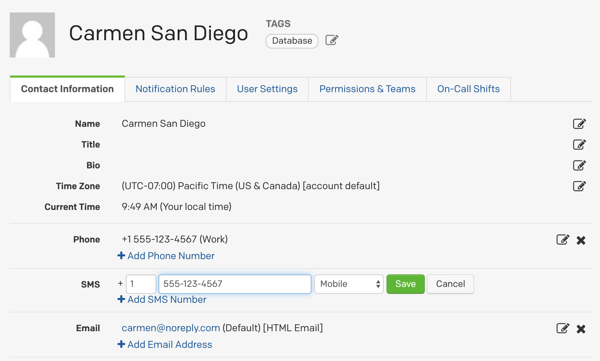
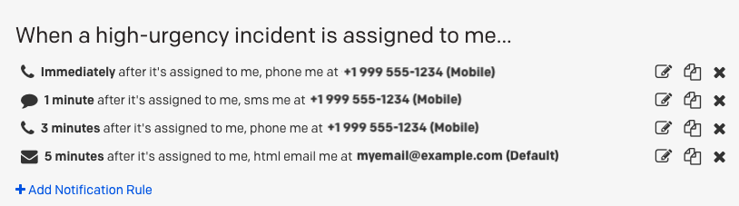
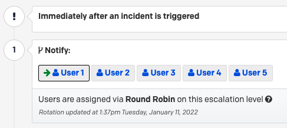
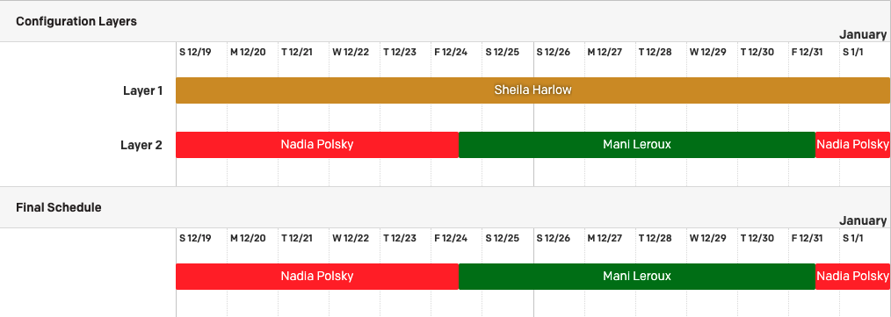
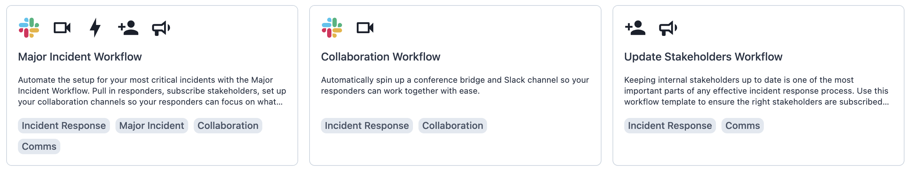
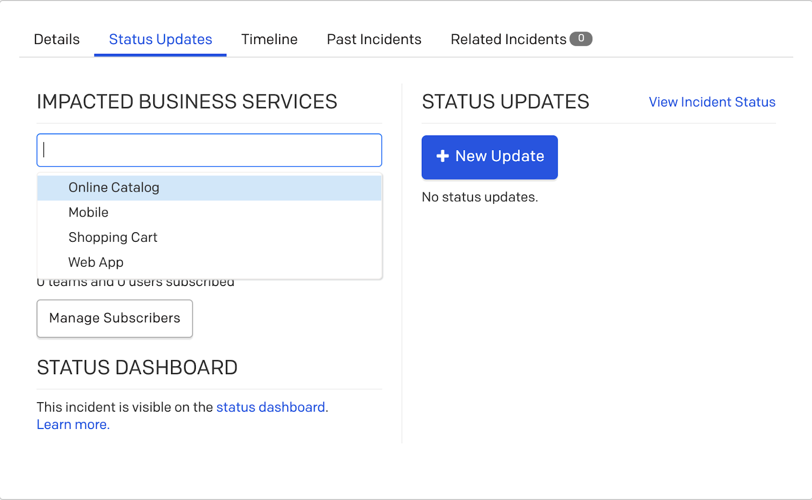

## PagerDuty Configuration
How to set up your Crisis Response Management instance in PagerDuty:

[PagerDuty Mobile app](https://support.pagerduty.com/docs/mobile-app){:target="_blank" } - Ask each member to install and configure the mobile app for maximum reachability.

[User Management](https://support.pagerduty.com/docs/users#add-users){:target="_blank" } - Make sure you’ve added your Executive Crisis Leadership and Crisis Response Team members to the system.

[Contact information](https://support.pagerduty.com/docs/user-profile){:target="_blank" } - Ask each member to log into the web application and update their profile information including their phone, email and SMS contact information especially if they’ve changed devices.

[Notification rules](https://support.pagerduty.com/docs/user-profile#notification-rules){:target="_blank" } - Ask each member to set their high urgency, low urgency, handoff and subscriber notification rules under their profile.

[Teams](https://support.pagerduty.com/docs/teams){:target="_blank" } - Create teams for your Executive Crisis Leadership Team, each of your Crisis Team Leaders, and essential support functions like Crisis Communications, IT or Legal

[Services](https://support.pagerduty.com/docs/services-and-integrations#create-a-service){:target="_blank" } - Create and configure a service for each of your crisis categories led by your Crisis Team Leaders, e.g., supply chain, human resources, critical infrastructure, geopolitics, physical security, etc.

[Urgency](https://support.pagerduty.com/docs/service-settings#notification-urgency){:target="_blank" } - Set your notification urgency for each service whether high, low, dynamic or based on operating hours

[Escalation policies](https://support.pagerduty.com/docs/escalation-policies#create-an-escalation-policy){:target="_blank" } - Decide who gets notified first and how long before the notification escalates to the next team member and configure round robin scheduling if you wish to alternate per crisis

[Integrations](https://support.pagerduty.com/docs/services-and-integrations#add-integrations-to-an-existing-service){:target="_blank" } - Add your instant messaging, video conferencing tool or create a custom email integration or connections to other systems for triggering alerts

[Schedules](https://support.pagerduty.com/docs/schedule-basics#create-a-schedule){:target="_blank" } - Create your on-call rotations for the teams associated with each crisis service

[Incident Priority](https://support.pagerduty.com/docs/incident-priority){:target="_blank" } - Add your custom classification scheme for your crisis response escalation levels

[Incident workflows](https://support.pagerduty.com/docs/incident-workflows){:target="_blank" } - Create your workflows for each crisis based on conditions such as priority, status and urgency using system templates or from scratch

[On-call readiness report](https://support.pagerduty.com/docs/on-call-readiness-reports){:target="_blank" } - Confirm that your teams are on-call ready and properly configured

[Postmortem template](https://support.pagerduty.com/docs/postmortems#customize-the-postmortem-template){:target="_blank" } - Configure your postmortem template to fit your needs post-crisis

[Status pages](https://support.pagerduty.com/docs/status-pages){:target="_blank" } - Configure your status page templates for internal stakeholders

