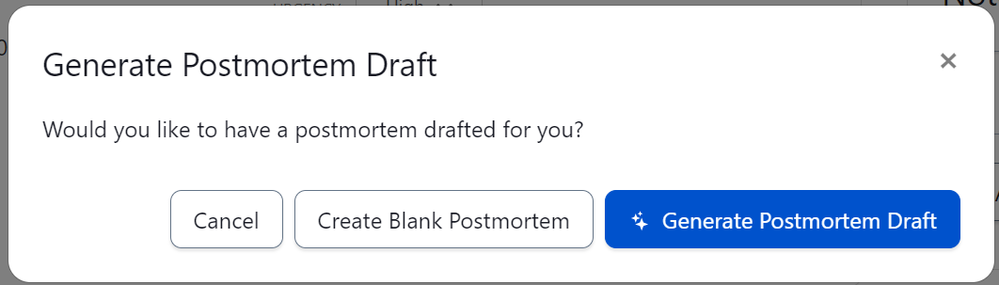

## Pre-crisis
You now have your Executive Crisis Leadership team, your crisis response management configured in PagerDuty, your 100-page crisis management plan and a shorter scenario-driven playbook for crisis response. Now what? This is the time to stress test your work before the real world does it for you. This step is crucial for flagging any gaps or blindspots you want to be aware of ahead of a crisis. This is also an opportunity to build strong leadership, reduce mean time to respond and develop good habits within your team.

## Crisis Simulations
Conducting discussion-based tabletop exercises with your team is an ideal starting point. However, leveraging functional exercises to simulate your level of maturity with crisis coordination, and command and control is also important. Running a crisis simulation using PagerDuty is as simple as triggering an alert on your crisis service—randomly if you really want to simulate real life. You would then follow your typical process of getting the right people on a conference call or instant messaging channel through an integration and running through a scenario with your corresponding playbook.

The PagerDuty platform will automatically track the length of the exercise and record any notes or status changes in the timeline which you can then use in your [postmortem](https://postmortems.pagerduty.com/what_is/) (i.e, after action report or hotwash) and in developing further tabletops or simulations. 

A biannual cadence for crisis simulations provides sufficient time for preparation and to review the findings in the postmortem.
