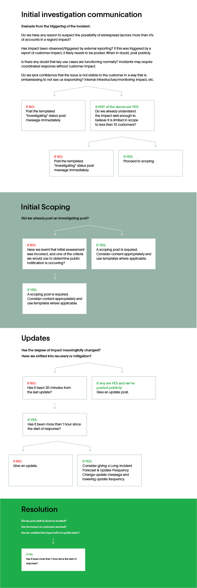

Information on how to manage external communications during an incident. See our [role descriptions](../before/different_roles.md) for information about who is responsible for external communications.

## When to communicate publicly

Before you decide to communicate an incident, it’s important to have an agreed-upon set of criteria for when a major incident is communicated. False alarms and short-lived issues can sometimes kick off incident calls, so knowing when communication is appropriate will help your customers avoid widespread panic. This can be tied to your organization’s definition of [what an incident is](../before/what_is_an_incident.md), and/or your [severity levels](../before/severity_levels.md).

You might consider the following criteria as well: 

1. Which products are affected?
1. How badly is the usage affected?
1. How many customers are affected?
1. How noticeable is the impact?
1. Is the impact something a customer may want to have contingencies for?

We also recommend coming up with a set of templates for different stages of an incident, including options for the communications below as well as special situations (long-running incidents, small or limited customer impact, incidents opened with immediate resolution, etc.) 

## How to communicate

### Initial communication:

The first communication should indicate that an incident is under investigation. The goal here is to avoid a customer experiencing symptoms of the incident, checking status pages or social media accounts, and not seeing awareness of the issue from the business. 

- Decision and posting of initial communication happens within 5 minutes of kicking off the incident call.
- These messages should be entirely templated for ease of action.
- These messages can be minimal in revealing scope which might not be known yet, but should indicate that scope will be coming soon. 

### Second communication: Initial Scoping of Impact

This is a message that should be delivered within 5 minutes of the first communication, once some scope of impact is known. This post should outline: 

- Customer impact
- An update of which components and/or functionality are impacted
- Which regions are affected.

### Updates

Depending on the length of the incident, periodic updates will be necessary. These updates should be delivered **at least** every 20 minutes from the scoping update during the first two hours of an incident. After two hours, you may choose to update with reduced frequency and shift to a long incident communication model (see below). Regardless of expected frequency, when the degree of impact has meaningfully changed, updates should be posted. These updates should:

- Indicate any changes to impact and/or scope
- Indicate if we believe we have shifted into recovery and/or mitigation steps. 
- Provide an expectation of when the next update will be posted.

Customers with special contracts around their Customer Support or Customer Success, such as a customer on a Premium Support plan, should also receive communication of impact delivered individually, whether through a Customer Liaison or their account team.

### Long Incidents

Incidents longer than two hours should be considered a long incident, and have different communication procedures as a result. When we know an incident will be extended, customer expectations have to be set appropriately, and customer notification fatigue due to content-less updates should be avoided. When in doubt, notify at the frequency which keeps updates meaningful. 

- Don’t determine this within the first hour of an incident.
- For incidents where we know a long running recovery, indicate this in an update when known.
- If planning to reduce update frequency, continue to provide expectations of when the next update will be posted.

### Resolution

Your final communication should be posted when full recovery of the incident has been confirmed by the Incident Commander. This update should include:

- Confirmation of full recovery
- Clear indication of any data loss or lingering corruption.
- If there are no lingering impacts, clearly note this in the update. 

Once this is posted, continue to follow the steps for [After an Incident](../after/after_an_incident.md) and the [Postmortem Process](../after/post_mortem_process.md). 

## Quick Reference

