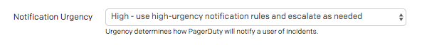
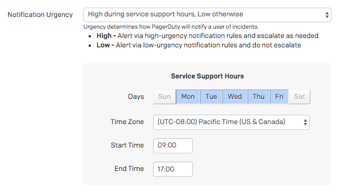
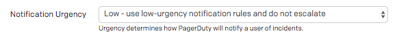
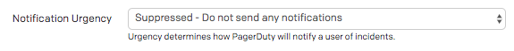

We manage how we get alerted based on a simple principle, **an alert is something which requires a human to perform an action**. Anything else is a notification, which is something that we cannot control, and for which we cannot make any action to affect it. Notifications are useful, but they shouldn't be waking people up under any circumstance.

!!! warning "High Priority Alerts"
    Anything that wakes up a human in the middle of the night should be **immediately human actionable**. If it is none of those things, then we need to adjust the alert to not page at those times.

| Priority | Alerts | Response |
| -------- | ------ | -------- |
| High | High-Priority PagerDuty Alert 24/7/365. | Requires **immediate human action**. |
| Medium | High-Priority PagerDuty Alert during **business hours only**. | Requires human action within 24 hours. |
| Low | Low-Priority PagerDuty Alert 24/7/365. | Requires human action at some point. |
| Notification | Suppressed PagerDuty Event. | No response required. Informational only. |

If you're setting up a new alert/notification, consider the chart above for how you want to alert people. Be mindful of not creating new high-priority alerts if they don't require an immediate response, for example.

## Examples

#### "Production service is failing for 75% of requests, automation is unable to resolve."_
This would be a **High** priority page, requiring immediate human action to resolve.

#### "Production server disk space is filling, expected to be full in 48 hours. Log rotation is insufficient to resolve."
This would be a **Medium** priority page, requiring human action soon, but not immediately.

#### "An SSL certificate is due to expire in one week."
This would be a **Low** priority page, requiring human action some time soon.

#### "A deployment was successful."
This would be a **Notification**, and should be sent as a suppressed event. It provides useful context should an incident occur, but does not require notifying a human.

