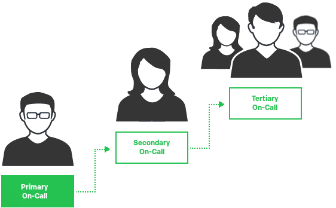
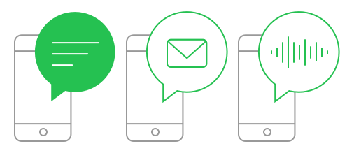
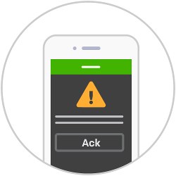

A summary of expectations and helpful information for being on-call.

## What is On-Call?
Being on-call means that you are able to be contacted at any time in order to investigate and fix issues that may arise for the system you are responsible for. For example, if you are on-call for your service at PagerDuty, should any alarms be triggered for that service, you will receive a "page" (an alert on your mobile device, email, phone call, or SMS, etc.) giving you details on what has broken and how to fix it. You will be expected to take whatever actions are necessary in order to resolve the issue and return your service to a normal state.

On-call responsibilities extend beyond normal office hours, and if you are on-call you are expected to be able to respond to issues, even at 2am. This sounds horrible (and it can be), but this is what our customers go through, and is the problem that the PagerDuty product itself is trying to fix!

## Responsibilities

1. **Prepare**
    * Have your laptop and Internet with you (office, home, a MiFi dongle, a phone with a tethering plan, etc).
        * Have a way to charge your MiFi.
    * Team alert escalation happens within 5 minutes, set/stagger your notification timeouts (push, SMS, phone...) accordingly.
        * Make sure PagerDuty texts and calls can [bypass your "Do Not Disturb" settings](https://support.pagerduty.com/docs/notification-phone-numbers).
    * Be prepared (environment is set up, a current working copy of the necessary repos is local and functioning, you have configured and tested environments on workstations, your credentials for third-party services are current and so on...)
    * Read our Incident Response documentation (that's this!) to understand how we handle serious incidents, what the different roles and methods of communication are, etc.
    * Be aware of your upcoming on-call time (primary, backup) and arrange swaps around travel, vacations, appointments etc.

1. **Triage**
    * Acknowledge and act on alerts whenever you can (see the first "Not responsibilities" point below)
    * Determine the urgency of the problem:
        * Is it something that should be worked on right now or escalated into a major incident? ("production server on fire" situations. Security alerts) - do so.
        * Is it some tactical work that doesn't have to happen during the night? (for example, disk utilization high watermark, but there's plenty of space left and the trend is not indicating impending doom) - snooze the alert until a more suitable time (working hours, the next morning...) and get back to fixing it then.
    * Check Slack for current activity. Often (but not always) actions that could potentially cause alerts will be announced there.
    * Does the alert and your initial investigation indicate a general problem or an issue with a specific service that the relevant team should look into? If it does not look like a problem you are the expert for, then escalate to another team.

1. **Fix**
    * You are empowered to dive into any problem and act to fix it.
    * Involve other team members as necessary: do not hesitate to escalate if you cannot figure out the cause within a reasonable timeframe or if the service / alert is something you have not tackled before.
    * If the issue is not very time sensitive and you have other priority work, create a JIRA ticket to keep a track of it (with an appropriate severity).

1. **Improve**
    * If a particular issue keeps happening; if an issue alerts often but turns out to be a preventable non-issue – perhaps improving this should be a longer-term task.
        * Disks that fill up, logs that should be rotated, noisy alerts...
    * If information is difficult / impossible to find, write it down. Constantly refactor and improve our knowledge base and documentation. Add redundant links and pointers if your mental model of the wiki / codebase does not match the way it is currently organized.

1. **Support**
    * When your on-call "shift" ends, let the next on-call know about issues that have not been resolved yet and other experiences of note.
    * If you are making a change that impacts the schedule (adding / removing yourself, for example), let others know since many of us make arrangements around the on-call schedule well in advance.
    * Support each other: when doing activities that might generate plenty of pages, it is courteous to "take the page" away from the on-call by notifying them and scheduling an override for the duration.

## Not Responsibilities

1. No expectation to be the first to acknowledge _all_ of the alerts during the on-call period.
    * Commute (and other necessary distractions) are facts of life, and sometimes it is not possible to receive or act on an alert before it escalates. That's what we have the backup on-call and schedule for.

1. No expectation to fix all issues by yourself.
    * No one knows everything. Your whole team is here to help. There is no shame, and much to be learned, by escalating issues you are not certain about. Our motto is "Never hesitate to escalate".
    * Service owners will always know more about how their stuff works. Especially if our and their documentation is lacking, double-checking with the relevant team avoids mistakes. Measure twice, cut once – and it's often best to let the subject matter expert do the cutting.

## Recommendations
If your team is starting its own on-call rotation, here are some scheduling recommendations from the Operations team.

* Always have a backup schedule. Yes, this means two people being on-call at the same time, however it takes a lot of the stress off of the primary if they know they have a specific backup they can contact, rather than trying to chose a random member of the team.
    * A backup shift should generally come directly after a primary shift. It gives chance for the previous primary to pass on additional context which may have come up during their shift. It also helps to prevent people from sitting on issues with the intent of letting the next shift fix it.

* The third-level of your escalation (after backup schedule) should probably be your entire team. This should hopefully never happen (it's happened once in the history of the Operations team), but when it does, it's useful to be able to just get the next available person.

* Team managers can (and should) be part of your normal rotation. It gives a better insight into what has been going on.

* New members of the team should shadow your on-call rotation during the first few weeks. They should get all alerts, and should follow along with what you are doing. (All new employees shadow the Operations team for one week of on-call, but it's useful to have new team members shadow your team rotations also. Just not at the same time).

* We recommend you set your escalation timeout to 5 minutes. This should be plenty of time for someone to acknowledge the incident if they're able to. If they're not able to within 5 minutes, then they're probably not in a good position to respond to the incident anyway.

* When going off-call, you should provide a quick summary to the next on-call about any issues that may come up during their shift. A service has been flapping, an issue is likely to re-occur, etc. If you want to be formal, this can be a written report via email, but generally a verbal summary is sufficient.

### Notification Method Recommendations
You are free to set up your notification rules as you see fit, to match how you would like to best respond to incidents. If you're not sure how to configure them, the Operations team has some recommendations,

* Use Push Notification and Email as your first method of notification. Most of us have phones with us at all times, so this is a prudent first method and is usually sufficient.
* Use Phone and/or SMS notification each minute after, until the escalation time. If Push didn't work, then it's likely you need something stronger, like a phone call. Keep calling every minute until it's too late. If you don't pick up by the 3rd time, then it's unlikely you are able to respond, and the incident will get escalated away from you.

## Etiquette

* If the current on-call comes into the office at 12pm looking tired, it's not because they're lazy. They probably got paged in the night. Cut them some slack and be nice.

* Don't acknowledge an incident out from under someone else. If you didn't get paged for the incident, then you shouldn't be acknowledging it. Add a comment with your notes instead.

* If you are testing something, or performing an action that you know will cause a page, it's customary to "take the pager" for the time during which you will be testing. Notify the person on-call that you are taking the pager for the next hour while you test.

* "Never hesitate to escalate" - Never feel ashamed to rope in someone else if you're not sure how to resolve an issue. Likewise, never look down on someone else if they ask you for help.

* Always consider covering an hour or so of someone else's on-call time if they request it and you are able. We all have lives which might get in the way of on-call time, and one day it might be you who needs to swap their on-call time in order to have a night out with your friend from out of town.

* If an issue comes up during your on-call shift for which you got paged, you are responsible for resolving it. Even if it takes 3 hours and there's only 1 hour left of your shift. You can hand over to the next on-call if they agree, but you should never assume that's possible.
