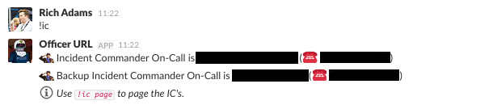
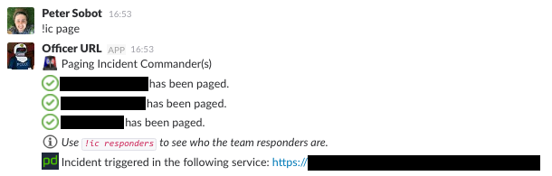
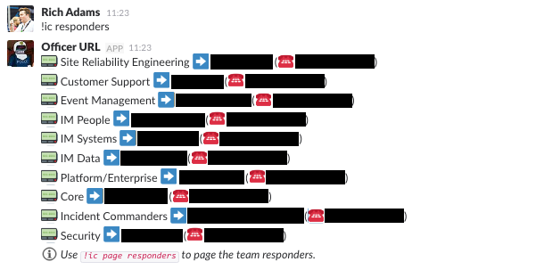
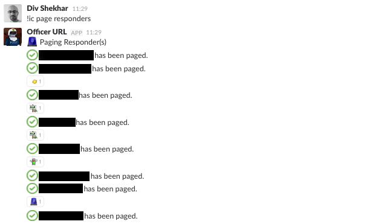

Throughout this documentation, references are made to various chat commands, all starting with an exclamation (e.g. `!ic page`). We have bots running in our Slack rooms which watch for these commands and execute various actions for us when they're detected. This page gives an overview of the commands we've referenced in this documentation, and what they do behind the scenes.

!!! question "Are these bots open-source?"
    The chat plugins and bots we use are unfortunately not currently open-sourced, however we would like to eventually get them open-sourced so that you can all benefit from them. In the meantime, the hope is that the descriptions on this page can help you to reproduce similar functionality with your own  tooling.

## Incident Response

Our `!ic` commands poll the PagerDuty API behind the scenes for various on-call schedules we specify. It caches the names and contact details for the current on-call users, so that if there's any issue in making API requests, the funtionality isn't impacted.

### `!ic`
This command lists out the current Incident Commanders on-call, their phone numbers, and a message telling users how to page them.

### `!ic page`
This is the command we use to manually trigger our incident response process. It uses the cached schedule information and will page all of the current Incident Commanders on-call (the primary, the backup, and any trainees who are shadowing). It will also notify into the room if it is unable to page them for any reason, and direct users to manually call the person using their contact information. Additionally, it will create a new PagerDuty incident and link users to it.

If for any reason we are unable to page the Incident Commanders automatically, the bot will let us know that it has failed, and give us the phone numbers for the relevant people so we can manually call them. Here is some example output from our test bot, where we have simulated being unable to page via PagerDuty due to an unresponsive API call.

### `!ic responders`
This works similarly to the `!ic` command, only it uses all our service team schedules instead of just the IC schedules. It will list out all the current people who are on-call for each engineering team. This is useful to also know who will likely be joining the incident call momentarily.

### `!ic page responders`
This works similarly to `!ic page`, only it pages the responders list instead of the Incident Commanders. This is rarely used, since generally only the relevant team will get paged. However, sometimes we require an "all hands on deck" response, and need the ability to quickly page all the current on-calls.

### `!ic who <user>`
Sometimes we may need to identify a specific individual to bring them onto a call. This command lists out the contact info for a specific user, and a message telling users how to page them.

### `!ic page <user>`
This will page a specific person by username.

## Status

Our `!status` commands look at our internal monitoring systems to determine the current system state, as reported by the systems themselves. This is the status our alerting tooling uses to automatically notify us of issues.

### `!status`
This will tell us the current overview of our system state. It will also alert us if it is unable to check for the status, since that could also be an indication of an issue. Typically though, it will hopefully show a status of `NORMAL`.

### `!status stalk`
This does the same as the above, only it polls every 30s until we stop it (with `!status unstalk`). It will only report the status into the chat room if it has changed since the last time it checked. We have this running during an incident so we can easily see if our system is getting worse or recovering without having to manually check our monitoring.

