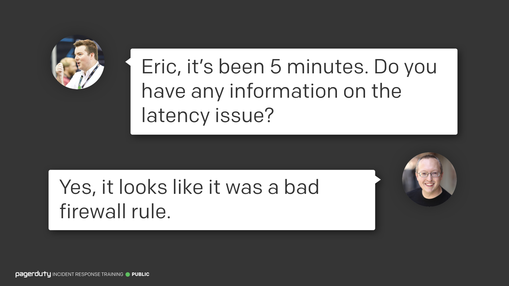
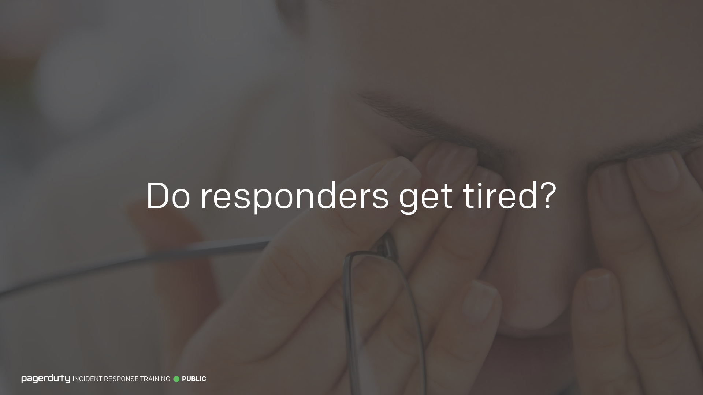
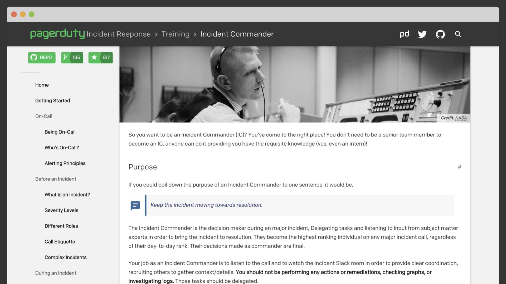

!!!info "Incident Response Training Course (2018)"
    This is an open-source version of "Incident Response Training", our PagerDuty training course for incident response and incident command. It started as an internal course to train new Incident Commanders and has since developed into one that we now deliver publicly. This is a snapshot of what the training looked like in 2018. The latest version is now part of our [PagerDuty University](https://university.pagerduty.com/) courses.

    It includes lots of introductory information on our process, and details on the Incident Commander role specifically. All the information is already available as part of our [public documentation](https://response.pagerduty.com), this is just a different way of presenting it that's hopefully more engaging. Feel free to use this as a base for training in your own organization.

    The text presented here is a semi-accurate transcription of how the training was usually delivered. You can also watch a [video](#video) of an even older version of this course if you prefer.

---

### Introduction

<input type="checkbox" id="001" /><label for="001"></label>
_001. "Incident Response Training"._

Hi, I'm Rich, and welcome to "Incident Response Training". This is a shorter version of our internal training at PagerDuty, which we use to train up our new Incident Commanders. It's been slightly adapted for a wider audience, but the majority is exactly what we run ourselves. We're not going to be able to cover everything, otherwise we'd be here for a few days, but I'll cover some of the most important parts of our process. I'll try to keep this as short as I can.

Actually, how long do we have? Can someone keep track of time for me? That would be great, thanks!

---

### Learn How to Effectively Manage Incidents

<input type="checkbox" id="002" /><label for="002"></label>
_002. Learn how to effectively manage incidents._

The goal of this session is to give you an understanding of how to effectively manage incidents within your organization. I'll describe the process we use at PagerDuty for managing critical incidents, and talk in more detail about a specific role called the "Incident Commander".

This isn't a sales pitch. I'm not on our sales team, and this isn't a talk about how to use PagerDuty to manage your incidents (although obviously it would be awesome if you did). The intent today is to introduce you to how we manage incidents internally at PagerDuty, and provide you with lots of practical information you can take away to your own organizations to either start or improve your own incident response processes.

---

### Replace Chaos with Calm

<input type="checkbox" id="003" /><label for="003"></label>
_003. Replace chaos with calm._

Let's start with a quick question. How does incident response usually go in your organization today? Is it a smooth and streamlined process, or is it a lot of people talking over one another? For most of you it's probably going to be somewhere in the middle.

We want less of the latter, and more of the former. We want to replace chaos with calm. Panic and chaos are not good during an incident, they only exacerbate things and causes more confusion. We want things to be calm and organized.

---

### What is Incident Response?

<input type="checkbox" id="004" /><label for="004"></label>
_004. What is incident response? [Docs Reference](../../before/what_is_an_incident/#what-is-incident-response)_

So when we talk about incident response, what we're really talking about is an organized approach to addressing and managing an incident. This is how we define incident response at PagerDuty. They key here is on the word _organized_. We don't want to be running around in a panic anytime an alert goes off. We want our response to be almost routine, and for everyone to work together like a well-oiled machine.

There's a quote I really like from an excellent book called [Incident Management for Operations](https://learning.oreilly.com/library/view/~/9781491917619/) that's appropriate here,

> Fire is not an emergency to the fire department . . . [Y]ou expect a rapid response from a group of professionals, skilled in the art of solving whatever issues you are having.

---

### Goal of Incident Response

<input type="checkbox" id="005" /><label for="005"></label>
_005. Goal of incident response. [Docs Reference](../../before/what_is_an_incident.md#what-is-incident-response)_

It may surprise you to learn the goal of incident response isn’t just about solving the problem. Give a thousand monkeys a keyboard and enough time and they can probably solve your problem. That's not good incident response. We want to solve the problem in a way which limits the damage caused, and reduces the recovery time and costs. I don’t just mean _financial_ cost either, there’s a cost associated with engineer health too. Constantly waking people up at 3am can have a dramatic negative effect on their health and happiness.

If financial impact is all you care about though, let's not forget that **people are expensive**. In a large organization, a phone bridge with 100 people sitting there mostly idle for several hours is not unheard of. If each of those people cost ~$100/hour, that’s $10K every hour! That’s _really_ expensive to the business.

---

### What is an Incident?

<input type="checkbox" id="006" /><label for="006"></label>
_006. What is an incident? [Docs Reference](../../before/what_is_an_incident.md#what-is-an-incident)_

Before we can respond to an incident though, we need to [define what an incident actually is](../../before/what_is_an_incident.md). It sounds silly, but if you’re not sure whether something’s an incident, you don’t know whether to respond to it.

Here is PagerDuty’s definition of an incident,

> An unplanned disruption or degradation of service that is actively affecting customers' ability to use the product.

"Customers" here doesn't just refer to external customers, but can refer to internal customers too.

Your definition might be different, and that’s OK. I just wanted to give you an idea of the kind of definition that can get you started. You want your definition to be simple, no more than a sentence, and easily understood by anyone.

You may notice that this is quite a broad definition though. A typo technically fits this description. As does a full outage. Obviously these are very different scenarios. So we do have something else too.

---

### What is a Major Incident?

<input type="checkbox" id="007" /><label for="007"></label>
_007. What is a major incident? [Docs Reference](../../before/what_is_an_incident.md#what-is-a-major-incident)_

We also have something we call a **major incident**. This is any incident where we require a coordinated response between teams. Again, this is just our definition at PagerDuty, feel free to use your own.

The intention behind this definition is that sometimes incidents can be handled by a single team, maybe the owners of a service that's having trouble. That rarely requires a large response in and of itself. But as soon as they need to involve another team, whether it's customer support, or database administrators, then we declare it to be a major incident and kick off a much larger response. The _coordination_ is key here, and we’ll talk more about this later.

But this still covers quite a range of potential incidents. We can get more granular.

---

### Severity Levels

<input type="checkbox" id="008" /><label for="008"></label>
_008. Severity levels. [Docs Reference](../../before/severity_levels.md)_

We also use [severity levels](../../before/severity_levels.md) to determine how severe an incident is, and what type of response it gets. We use `SEV-5` through `SEV-1` for our levels, but you may use a different scheme, `P0` through `P5`, or maybe even emoji, 🔥 through 💩, etc.

Let's imagine you're looking at a graph of traffic to your website. You can typically determine severity based on how drastically your metrics are affected. So as your website traffic drops, the severity increases.

You will usually reach a point where you've set some predefined target or watermark, where as soon as the metric passes, you automatically consider something a major incident. At PagerDuty it's the difference between a `SEV-3` and `SEV-2`, but it may be different for your organization. Then as things get even more dire, we get into our `SEV-2`'s and our `SEV-1`'s when things completely flatline.

Having pre-defined thresholds and metrics can allow you to have automatic triggers for your response process.

???+ aside hide-arrow "We recommend using metrics tied to business impact."
    Metrics can be very useful, and often work best when they're tied to _business impact_. For example, a metric we monitor at PagerDuty is "number of outbound notifications per second", at Amazon it could be "number of orders per second", at Netflix it might be "stream starts per second", etc. Monitoring these important business metrics will then let you use automation to determine the severity of an incident and the type of response you use.

    If you use metrics that aren't tied to business impact (e.g. "CPU usage is high on a host"), then it's difficult, and sometimes impossible, to determine the severity of an incident associated with that metric.

    You want to use a metric that lets you know how your business is doing, not how a particular piece of equipment is doing.

---

### Anyone Can Trigger Incident Response

_<input type="checkbox" id="009" /><label for="009"></label>_
_009. Anyone can trigger incident response at any time._

But sometimes you won't know the impact straight away. Or maybe your metric hasn't reached the predefined threshold yet. We still need a way for a human to jump in and call something a major incident.

So even though we have automation at PagerDuty, we also have a mechanism whereby anyone can trigger our major incident response process at any time. This is very important for us. We've found that **lowering the barrier to triggering incident response has lead to a dramatic increase in the speed with which incidents are resolved**.

We don't want people to sit on something because the official alarm hasn't gone off yet. If customer support gets lots of requests very quickly, it's a good sign there's something wrong, and we need them to be able to raise the alarm. We've even had interns trigger our incident response process in their first week. If the janitor walks past a graph and thinks it looks wrong, I want them to be able to trigger incident response.

We were initially hesitant to introduce this, as we feared it would lead to lots of false positives. People triggering the alarm in an abundance of caution and it not really being an incident. But we've seen quite the opposite, people are pretty good at policing this themselves. Only twice have we had it be a false alarm, and both times it was warranted based on the information available at the time. Even if you do get a false positive now and then, you can use it as free practice.

---

### Triggering Incidents via Chat

<input type="checkbox" id="010" /><label for="010"></label>
_010. Triggering incidents via chat. [Docs Reference](../../resources/chatops.md#ic-page)_

So how do we let humans trigger the process? We do it with a [chat command](../../resources/chatops.md), but don’t feel like that’s the only right way. I just wanted to demonstrate how we do it to give you an idea. You can do it however your want. Air horn, flashing light in the office, hire a mariachi band, etc.

The point is you want a way to trigger your response that's fast, easy, and available to everyone.

---

### Peacetime vs Wartime

<input type="checkbox" id="011" /><label for="011"></label>
_011. Peacetime vs Wartime. [Docs Reference](../../before/what_is_an_incident.md#mentality-shift)_

Once an incident is triggered, we need to switch our mode of thinking. We need a [mentality shift](../../before/what_is_an_incident.md#mentality-shift). We want a distinction between “normal operations” and “there’s an incident in progress”. We need to switch decision making from peacetime to wartime. From day-to-day operations, to defending the business.

Something that would be considered completely unacceptable during normal operations, such as deploying code without running any tests, might be perfectly acceptable during a major incident when you need to restore service quickly.

The way you operate, your role hierarchy, and the level of risk you’re willing to take will all change as we make this shift.

---

### Normal vs Emergency

<input type="checkbox" id="012" /><label for="012"></label>
_012. Normal vs Emergency. [Docs Reference](../../before/what_is_an_incident.md#mentality-shift)_

Some people don’t like the peacetime/wartime analogy, so you can call it what you want. Normal/Emergency.

---

### OK vs Not OK

<input type="checkbox" id="013" /><label for="013"></label>
_013. OK vs Not OK. [Docs Reference](../../before/what_is_an_incident.md#mentality-shift)_

Or OK/NOT OK. What you call it isn't as important as being able to make the mental shift.

---

### Incident Command System

<input type="checkbox" id="014" /><label for="014"></label>
_014. Incident Command System (ICS). [Docs Reference](../../training/overview.md#national-incident-management-system-nims)_

So let’s talk about our process a bit more. The way we do incident response at PagerDuty isn’t something we invented ourselves, it is heavily based on the [Incident Command System](https://en.wikipedia.org/wiki/Incident_Command_System), usually abbreviated to ICS.

ICS was developed after some [devastating wildfires in Southern California](https://en.wikipedia.org/wiki/Laguna_Fire) in 1970. Thousands of firefighters responded, but found it difficult to work together. They knew how to fight fires individually, but lacked a common framework to work effectively as a larger group.

After the fires, an interagency group called [FIRESCOPE](https://en.wikipedia.org/wiki/FIRESCOPE) (Which believe it or not is an acronym for "FIrefighting REsources of Southern California Organized for Potential Emergencies") was formed and set out to develop two systems for managing wildland fire. One of those systems became known as ICS, and eventually became a national model for command structures at any major incident.

In 2004, the [National Incident Management System (NIMS)](https://en.wikipedia.org/wiki/National_Incident_Management_System) was established by FEMA, and is now used as the standard for emergency management by all public agencies in the United States. NIMS defines several operational systems as part of it, of which ICS is one.

It’s used by everyone from the local fire department responding to a house fire, to the US government responding to a natural disaster. It provides a standardized response framework that everyone is familiar with.

NIMS and ICS are the basis of the process we use at PagerDuty, however we have heavily modified it for our needs. Turns out that things can be streamlined a bit when human life isn't on the line.

---

### Incident Response Around The World

<input type="checkbox" id="015" /><label for="015"></label>
_015. Incident response around the world. [Docs Reference](../../training/overview.md#incident-response-around-the-world)_

It's worth noting that even though our process is based on the US systems, NIMS and ICS, there are many similar systems in use all over the world. While many are also based on ICS, some were developed separately, yet offer many of the same features.

I particularly like [the UK system](https://en.wikipedia.org/wiki/Gold%E2%80%93silver%E2%80%93bronze_command_structure), simply because it has a role called the "Gold Commander", which just sounds like a Bond villain.

When developing our process at PagerDuty, we looked at a few of the other systems in use around the world, and chose the bits we liked the most to add to our own.

???+ aside hide-arrow "Emergency Management Around the World"
    If you're interested in learning more about the systems in use by other countries, we have [links to some official resources](../../resources/reading.md#official-resources).

    There's also a book available from the US FEMA website, called "[Comparative Emergency Management: Understanding Disaster Policies, Organizations, and Initiatives from Around the World](https://training.fema.gov/hiedu/aemrc/booksdownload/compemmgmtbookproject/)" where it compares the systems used by about 30 different countries.

---

### Roles

_<input type="checkbox" id="016" /><label for="016"></label>_
_016. Roles of incident response._

So let's talk about the [roles involved in our process](../../before/different_roles.md). I'm going to introduce the roles one by one, but I don't want you to get scared by the number that will be on the slide by the end. We didn't start with this many roles, and we don't have people filling all the roles in every incident. This is just showing the available roles, and defining what they are. The process and roles will grow and shrink to fit the size of the incident at hand.

While we don’t use exactly the same roles as ICS, we picked out the ones that matter for us in order to get our role structure.

* First up is the **Incident Commander**, usually abbreviated to IC. They're the person in charge and the most important role in the process. They make all the decisions, and all information flows up to them. What they say goes. I'm going to be talking more about this role in a moment, so we'll continue on with the others for now.

* Next up we have the **Deputy**. This is basically a backup Incident Commander. They're training as an IC and will be listening to all the same information. They help to make sure nothing gets missed by the IC, and acts as a hot-swap standby should the IC want to handover command. This is one of those roles you won't need if you're just starting out. For a long time our Deputy and Scribe would be the same person.

* Then we have the **Scribe**. The scribe's job is to keep an accurate timeline of events. What has happened, when it happened, and the key decisions that have been made. We use Slack for this, and the Scribe will be writing down notes into a Slack room, which gets us nicely timestamped data. It's worth noting that they're **not doing a direct dictation** of a voice call. It's not "John said this, Mary said this". It's more like "We're deciding between A and B, we've decided on A".

Together, these roles are called the Command Staff.

* Next we have the **Customer Liaison**. This is a member of our support team, and their job is to handle the two-way interaction with our customers. So they'll update customers as to what is going on, whether that's via email, tweet, or updating our status page. But they'll also let us know what customers are saying too. If we're getting 100's of support requests, or no one has raised a ticket at all. Since this can be useful information in tracking down a cause, and determining the level of risk we can take during our recovery.

* The **Internal Liaison** is a relatively new role in our process. Their job is to handle all the interaction with internal teams, such as our executives, or our marketing teams, and so on. We have a separate Slack channel for incident updates, to which the Internal Liaison will post regular status updates, and answer any questions from the rest of the organization. This keeps those questions out of our main response, but allows people to still get answers. The internal liaison will also page other teams as necessary if they're needed on the response. Again, this isn't a role you'll need for most companies, for a while this was also handled by our Deputy/Scribe role.

Together, these are the liaisons.

* Finally, we have the **Subject Matter Experts**, or SME's. These are the people who will actually be fixing the problem. They'll be the ones logging into servers, changing code, and running commands.

Today, I’m going to focus on one role in particular, that of the Incident Commander.

---

### Incident Commander

<input type="checkbox" id="017" /><label for="017"></label>
_017. Incident commander. [Docs Reference](../../training/incident_commander.md)_

The incident commander is one of the most important roles you can have. Even if you don’t have deputy, scribe, customer liaison, etc. The Incident Commander is one you should get first (well, after the SME’s of course, you probably need someone to solve your problem before you need someone to coordinate the response).

---

### Single Source of Truth

<input type="checkbox" id="018" /><label for="018"></label>
_018. Single source of truth._

They’re the single source of truth during an incident, and are the ones in charge. The big cheese. They make all decisions, and no action should be performed unless the IC has said so.

---

### Highest Ranking Person

<input type="checkbox" id="019" /><label for="019"></label>
_019. Highest ranking person._

No matter their day-to-day role, and IC is always becomes the highest ranking person on the response. They're running the show. Remember what we talked about earlier with the mentality shift? Well, this is one of the things that will change during an incident.

???+ aside hide-arrow "Is the Incident Commander a dictator?"
    Only in the sense that they are in charge and their decisions cannot be overruled. They do not rule by force, or go on power trips and order people around for the sake of it. A good Incident Commander will **listen** to their experts and make the best decision they can based on the information available. Incident Commanders should show empathy towards all responders.

---

### Higher than the CEO

<input type="checkbox" id="020" /><label for="020"></label>
_020. Higher than the CEO._

Even if the CEO joins the response, the IC still outranks them in an incident response situation. **This is absolutely critical for successful incident response, but it does require buy-in from your executives.** Please don't surprise your CEO with this, it will not go well for you.

Whether this works for you will depend on your organization. This is how we do it at PagerDuty and it works well for us, but I can imagine it not being easy to get this sort of buy-in in other organizations. I used to work in the airline industry, and I don't think this rule would fly there (Get it? Airline industry. Fly. Hello? This thing on?).

---

### Not a Resolver

<input type="checkbox" id="021" /><label for="021"></label>
_021. Not a resolver._

Importantly, the IC doesn't resolve the incident, they coordinate and delegate all tasks. They're the conductor of the orchestra, they're not playing an instrument. They're not acting as a resolver, and shouldn't be looking at graphs, or logging into servers.

This can be especially hard sometimes if the IC is an engineer in their day-to-day role, as they may naturally want to jump in to try and help, but that urge must be resisted if they're acting as an IC. If they absolutely are the only person who can solve the problem, then they should handover to another Incident Commander and assume the role of a Subject Matter Expert instead. We'll talk a bit more about this scenario later.

---

### BSOD

_<input type="checkbox" id="022" /><label for="022"></label>_
_022. Uh oh!_

Oh dear, that’s not good. Did something go wrong? Seems we have ourselves an incident!

So what do you do when things break in the middle of the night? What's the first step to responding to an incident?

It turns out that the first step in any incident response is always the same, whether you're a small startup or a large enterprise. Whether there's 25 cents on the line, or 25 billion dollars.

---

### Don't Panic

<input type="checkbox" id="023" /><label for="023"></label>
_023. Don't panic._

**Don’t panic.** It elevates stress, and causes others to panic. It’ll end up hurting your incident response a lot more.

_It's OK to panic on the inside._ We're only human after all. It's a natural reaction to panic in these sorts of situations a little bit. Everything about getting paged is designed to get adrenaline flowing. Loud pager sounds and so on. Just try not to outwardly show panic, because it will cause others to do the same. Act calm, and others will follow suit.

Those with experience will stay calm, and that can make the difference between a chaotic incident, and one that resolves smoothly. So don’t panic!

---

### IC Introduction

<input type="checkbox" id="024" /><label for="024"></label>
_024. "Hi, I'm Rich, I'm the Incident Commander". [Docs Reference](../../training/incident_commander.md#start-of-call-announcement)_

But today we're lucky to have an IC here.

> Hi, I'm Rich, I'm the Incident Commander.

Every call should start like this. Well, use your own name and not mine, but you get the idea.

There are a few important things here with the way I phrased this.

??? aside  "What if you join a call and there's no IC?"
    It doesn't always work out that the first person to join the call is the incident commander. So what do you do in that case? Some guides will recommend the first person who joins acts as the Incident Commander, regardless of training. ICS usually works this way, where the first person on-site acts as the IC until someone more qualified arrives. We tried that and found it just doesn't work in practice. For example, let's say that the first person to join your response call becomes the acting IC. After an incident occurs, how long do you think it will be before one of your responders joins the call?

    Yeah, turns out it's about 10 minutes. Because people are afraid of being the IC. You can't force someone to be an IC, and we prefer to make sure the acting IC at least has the training. It may add a few minutes to the start of an incident, but it makes it go smoother and quicker overall. If a trained IC joins the call and there's isn't an existing IC, they will take on the role. They ask "Is there an IC on the call?.... hearing nothing, this is X, I'm the Incident Commander".

    It's also worth noting that the on-call IC doesn't automatically take over when they join. Whoever is the active IC on the call is in charge until they perform a handover.

---

### Introduce Yourself

<input type="checkbox" id="025" /><label for="025"></label>
_025. Introduce yourself._

Firstly, I introduced myself by name. I didn't just say "Hi, I'm the IC". I'm not an emotionless robot.

Introductions are important so that people know who you are. They’ll usually be referring to you as "IC", rather than by name, but it still humanizes you more. If you introduce yourself by name people will treat you differently and it'll help to make things go a little bit smoother.

You’ll find soon that a lot of the job of an IC involves psychology and phrasing more than technical expertise.

---

### Say Incident Commander

<input type="checkbox" id="026" /><label for="026"></label>
_026. Say "Incident Commander"._

Then I said that I'm the "Incident Commander". I didn't abbreviate to IC, since new people might not understand the lingo yet. Stating it that way made it very clear. We want to make sure we **always use clear language**. Additionally, saying the word "Commander" here will subconsciously instill in people that you're in charge.

---

### Good Communication

<input type="checkbox" id="027" /><label for="027"></label>
_027. Good communication is essential._

Good communication is essential. A breakdown in communication can hamper the entire response process. One of your jobs as an IC is to keep the lines of communication clear and maintain discipline. Don’t throw weird or unfamiliar acronyms into the discussion.

---

### Acronym Overload

<input type="checkbox" id="028" /><label for="028"></label>
_028. Acronym overload._

Too many acronyms and internal lingo will upset newcomers and adds cognitive overhead. As shown in this completely realistic example.

It takes much longer to say "Let's get the Incident Commander on the response call, then get a bacon, lettuce, and tomato sandwich for all the Subject Matter Experts". But it's much clearer what is being asked for.

---

### Clear is Better Than Concise

<input type="checkbox" id="029" /><label for="029"></label>
_029. Clear is better than concise. [Docs Reference](../../before/call_etiquette.md#lingo)_

Clear instructions are more important than concise instructions. You want to **favor explicit and clear communication over all else**. If you have the choice between taking 5 seconds and abbreviating, or taking 30 seconds and making it clear, take 30 seconds. Don’t give a long essay, but make sure the instructions are unambiguous.

There's a tendency to want to rush through an incident, that every second counts, and that you need to use abbreviations to get the fastest possible response. Unfortunately you'll find that using unfamiliar and unclear language will almost always prolong an incident.

---

### What's Wrong?

<input type="checkbox" id="030" /><label for="030"></label>
_030. What's wrong? [Docs Reference](../../training/incident_commander.md#size-up)_

OK, so how do we actually start solving our problem?

The first step is to collect information from your Subject Matter Experts (SME) for their services/area of ownership. Ask what's wrong, and gather the symptoms of the incident. Is it only affecting one system? Is it affecting everything? Was there a specific metric that triggered an alarm?

We call this “[sizing up](../../training/incident_commander.md#size-up)”. We're trying to get an idea of the scope of the incident.

---

### What Actions Can We Take?

<input type="checkbox" id="031" /><label for="031"></label>
_031. What actions can we take? [Docs Reference](../../training/incident_commander.md#stabilize)_

Next we want to ask our experts what they want to do to fix their systems. Remember, the IC isn't coming up with solutions, we want to ask the people who are the experts for their services what they want to do to. They will have a much better idea of the actions that can be taken. We want to collect proposed repair actions.

---

### What Risks Are Involved?

<input type="checkbox" id="032" /><label for="032"></label>
_032. What are the risks involved?_

Importantly, we also want to make sure we ask what risks are involved with the proposed actions. "What impact will that have?", "What are the risks involved?", "How confident are you it will work?".

Without this information, we can't make an informed decision. For example, if we need to restart our servers to fix a problem, we could either reboot them all at once and be done in 30 seconds, or we could do a rolling restart and take 10 minutes. On the surface of it, the first option sounds like the best.

But, if we ask for the risks involved, we'll learn that the first option will cause downtime for everyone in those 30s, whereas the second option, while slower, will result in no downtime for end users. This can change the decision you make, so it's important to get the information.

---

### Make a Decision

<input type="checkbox" id="033" /><label for="033"></label>
_033. Make a decision._

Once we have a collection of actions and their associated risks, it's time to make a decision. Sometimes there's an obvious path forward, with one option being clearly better. But sometimes you're presented with two equally bad options.

There’s no golden rule here I can give you, it’ll be up to context and your company culture. But my advice if you can't decide between two options is to literally flip a coin. **Making the wrong decision is better than making no decision.** Making no decision doesn't help to make forward progress, you learn nothing new and the incident is still going on. Making a decision, even if it's the "wrong" one will give you more information. If it turns out to be wrong, you can then put all your resources into the other option.

A wrong decision gives you more useful information, making no decision gives you nothing. You want to avoid [decision paralysis](https://xkcd.com/1801/) at all costs, as it can prolong your incident further.

???+ aside hide-arrow "'Do nothing' is an acceptable decision."
    I should note that the above advice is intended for the situation when you can't decide between two options. "Do nothing" is a perfectly acceptable decision if that's the course of action you want to take. It is sometimes appropriate to get more information by waiting and seeing what changes.

---

### Gain Consensus

<input type="checkbox" id="034" /><label for="034"></label>
_034. Gain consensus._

Once we've made a decision, we need to gain consensus for our plan. But wait, why? Didn't I say earlier that the IC is basically a dictator and everyone should follow their instructions? While technically true, we want to be sure we give a chance to listen to any potential problems our experts may have with the plan. We don't want people to come back later and say things like "I knew that wouldn't work". We want to make sure we stop the [hindsight 20/20 problem](https://en.wikipedia.org/wiki/Hindsight_bias). It demotivates responders, and wastes time.

But gaining consensus amongst a large group of people can be a bit difficult.

---

### Blue Background

<input type="checkbox" id="035" /><label for="035"></label>
_035. This background is blue._

Let's look at a quick example to show what I mean,

> I propose that this background is blue. Does everyone agree?

???+aside hide-arrow "Audience participation!"
    This is where I would usually get few people from the audience nodding or quietly saying "Yes". I'll point to about 5 or 6 people who did nothing and ask them one by one if they agree. Until it gets uncomfortable.

See how long it’s taking us to reach consensus? **Distributed consensus is hard**, you’ll be there forever trying to agree on the proposed actions.

Let's try it a different way,

> I propose that this background is blue. Are there any strong objections? ... Hearing none, the background is blue, let's proceed.

---

### Any Strong Objections?

<input type="checkbox" id="036" /><label for="036"></label>
_036. Are there any strong objections? [Docs Reference](../../training/incident_commander.md#gaining-consensus-polling-during-a-decision)_

See how much faster that was? I **implicitly got the consensus of everyone in the room**, so none of you could come back later and say you didn't think the background was blue, because I gave you all a chance to object.

Doing it this way optimizes for the 99% case. Most of the time there won’t be any objections and you can just continue. But likewise, we don't really care if people agree with us. We care if people _disagree_, that's the information we need the most. If you ask everyone to agree, you may get one person saying "No" with a really important point, but you can't hear them because everyone else is saying "Yes".

---

### Strong

<input type="checkbox" id="037" /><label for="037"></label>
_037. STRONG objections._

This is one of the most useful phrases in your toolkit as an IC as it allows you to get consensus on a decision very quickly, and prevents the hindsight problem from popping up later. The way we phrased it though is important, the word "**strong**" subconsciously instills in people that we're still in an incident situation, and normal concerns might not apply.

Make sure to leave enough of a pause for people to raise any objections they may have. It's no good asking for strong objections then moving on. All responders need to have the opportunity to raise a concern.

So now that we have consensus, we need to execute the plan, that means assigning the task to someone. Before we do that though, I have a quick question.

---

### How Long Have I Been Talking?

<input type="checkbox" id="038" /><label for="038"></label>
_038. How long have I been talking?_

At the start, I asked if someone could keep track of the time for me. Did anyone actually do that? Can anyone tell me exactly how long I've been talking?

Probably not. But why not? I clearly asked.

It's likely because of how I phrased the question.

---

### Bystander Effect

<input type="checkbox" id="039" /><label for="039"></label>
_039. Bystander effect._

I said "Can someone...". This is called the [bystander effect](https://en.wikipedia.org/wiki/Bystander_effect). Everyone assumed someone else was doing it, so no one ended up doing it. If by some chance, someone actually did do it, you won't know who it is anyway, or if they've even started.

A good example of this is if there's a medical emergency, and you shout "Somebody call 911!", you'll find that no one does, because everyone assumes someone else is doing it. If you're ever in that situation, you want to point to someone and say "You, call 911". Then it'll get done.

???+ aside hide-arrow "Localization"
    If you're outside the US, substitute 911 for whatever your local emergency number is. You probably don't want to be shouting "You, call 911" if you're in Europe for example.

So what I should've done was point to someone in the room and say,

> You, please keep track of the time and give me a little wave when we get to 30 minutes, starting now. Understood?

See how different that was?

---

### Assigning Tasks

<input type="checkbox" id="040" /><label for="040"></label>
_040. Assigning tasks. [Docs Reference](../../training/incident_commander.md#assigning-tasks)_

In the context of an incident, that might look like this. It's a little more verbose than "Can someone investigate the cause?", but it's a lot clearer what I want to happen. Brings us back to clear is better than concise from earlier.

Several important things happened in this exchange as I was assigning the task.

---

### Assign Specific People

<input type="checkbox" id="041" /><label for="041"></label>
_041. Assign tasks to a specific person._

First, the task was assigned **directly to a specific person**. It’s ok to assign it to a role to “DBA on-call…”, etc. But it must be a single individual. Don't assign things to a group, because they won't get done.

---

### Time Limit

<input type="checkbox" id="042" /><label for="042"></label>
_042. Time-box all tasks._

Second, the task was given a time-limit. This means the SME knows exactly how long until I come back to them for an answer, so they won’t be surprised or caught off guard. It sets the expectations.

---

### Acknowledgement

<input type="checkbox" id="043" /><label for="043"></label>
_043. Get acknowledgement._

Finally, I confirmed that they had understood the instructions and are going to carry them out. So I don’t come back in 5 minutes and find they never started, or have additional questions.

---

### Followup

<input type="checkbox" id="044" /><label for="044"></label>
_044. Followup._

Then after the time is up, we can simply ask for the results of their task. Of course they will always have the right answer the first time and will never need any additional time to investigate, right?

---

### Need More Time?

<input type="checkbox" id="045" /><label for="045"></label>
_045. What if they need more time?_

It's not always going to be the case that things get done within the timeframe. So what do you do if, after 5 minutes, they need more time?

Don’t just give them another arbitrary time limit, because they’ll keep coming back and you’re just going to be wasting time giving them 5 minutes chunks for an hour. Instead, ask your experts how long they need.

---

### More Time

<input type="checkbox" id="046" /><label for="046"></label>
_046. More time._

This isn't going to be like in the movies, where you ask how long someone needs, they say two hours and you slam you fist on a table and say "You've got one!". You need to **trust in your experts** to give you accurate estimates, and give them the time they need. Putting people under unreasonable pressure is only going to lead to mistakes being made.

???+ aside hide-arrow "You can do this the first time too."
    You can also just ask your experts how long they need the first time you hand out the task instead of picking a time yourself. Sometimes we've found it easier to give a time-limit ourselves if it's an action that's been done before and we have a rough idea of how long it should take. But there's nothing wrong with asking how long someone needs as you assign the task either.

---

### Solving Incidents (1)

<input type="checkbox" id="047" /><label for="047"></label>
_047. Flow chart for solving incidents._

And we just keep following this pattern until the incident is resolved.

1. Ask for a status from your experts.
1. Decide on an action based on what you’re told, gaining consensus for the plan.
1. Assign the task out.
1. Follow up with the tasks once done, and repeat if there are still problems.

---

### Solving Incidents (2)

<input type="checkbox" id="048" /><label for="048"></label>
_048. Another flow chart for solving incidents.._

More generally, we’re following [this cycle](../../training/incident_commander.md#handling-incidents) for each incident. We size-up the situation, stabilize things (that's the loop we just showed), keep everyone updated as to what's going on, then verify the situation is fixed before ending the response. If it's not fixed, we start again.

---

### Ignore the IC

_<input type="checkbox" id="049" /><label for="049"></label>_
_049. "Ignore the IC, do what I say!"_

Uh oh, an executive has joined the response and is trying to override the IC’s decisions. That’s not great.

Remember that the IC is the ultimate authority in incident response, their decisions are the ones that matter. So how do you handle the awkward situation when someone tries to override those decisions?

We have a top tip here, a great question to keep in your tool belt as an incident commander. A simple question that can immediately diffuse this situation.

---

### Do You Wish To Take Command?

<input type="checkbox" id="050" /><label for="050"></label>
_050. Do you wish to take command? [Docs Reference](../../training/incident_commander.md#executive-swoop-overriding-the-incident-commander)_

> Do you wish to take command?

Watch how quickly they don’t answer with “yes”.

If they do, great! You’re off the hook and can respond with,

> Understood. Everyone on the call be advised, I'm handing over command to executive A. They are now the Incident Commander.

But most of the time they’ll say either say "No"", or not answer at all, in which case you can continue on as normal, perhaps saying,

> In that case, please cause no further interruptions or I will have to remove you from the call.

But "Do you wish to take command?" is the most useful phrase for dealing with that kind of executive hostile takeover.

---

### Executive Swoop

<input type="checkbox" id="051" /><label for="051"></label>
_051. Executive swoop._

This is a class of problem we call Executive Swoop. Well, actually it's "Executive Swoop and Poop", but I was asked not to put that on the slide.

The previous example isn't typical though. It's rare for someone to come in and purposefully start causing a problem like that.

We're going to look at some more common examples of executive swoop next, but it's worth noting that **none of these happen maliciously**. No executive joins with the intent of hindering the process, they’re trying to motivate people and find out what’s going on. It’s their business too! Making sure your executives understand why these things are a problem is important, so be sure to followup after an incident if these things happen.

---

### Let's Resolve This in 10 Minutes

<input type="checkbox" id="052" /><label for="052"></label>
_052. Let's try and resolve this in 10 minutes._

> Let's try and resolve this in 10 minutes please!

This one definitely wasn't said by anyone at PagerDuty ever. Nope. Definitely not.

On the surface this seems pretty benign. The executive is merely trying to motivate staff and encourage them to solve the problem quickly, right?

Unfortunately, that's not how others on the call are going to interpret it. Instead they're more likely to be sarcastically thinking "Well, I was going to take an hour, but since you've said that, OK I'll do it in 10 minutes". It assumes people aren’t already working as hard as possible to solve the problem. It demotivates responders, and adds additional stress.

Your job as IC is to nip this in the bud and keep things on track.

---

### Keep Comments Until The End

<input type="checkbox" id="053" /><label for="053"></label>
_053. Keep your comments until the end. [Docs Reference](../../training/incident_commander.md#executive-swoop-anti-motivation)_

To keep things moving, you need to remind the executive of what's going on, and direct questions to be handled at a later time. It may come across slightly abrupt, but it gets the point across quickly and allows you to keep moving. Most people will pick up on the subtext here.

> We're in the middle of an incident, please keep your comments until the end.

Remember, **don't be mean**, just state the facts and keep things flowing. We're not trying to shame people or make them feel bad, we're trying to keep our incident moving towards a resolution.

---

### Spreadsheet of Affected Customers

<input type="checkbox" id="054" /><label for="054"></label>
_054. Can I get a spreadsheet of affected customers?_

> Can I get a spreadsheet of all affected customers?

Another one that's definitely never been mentioned on any PagerDuty incident response call ever.

An exec joins the call and wants to get a list of impacted customers. The problem is that in order to find that out, we'll need to take someone away from the effort of responding to the incident, at a time when we need them most. If you can spare the resources, then feel free to dedicate some to finding the information. But more often than not you wont have the resources to spare. So we can just tell the executive that.

---

### The Incident Takes Priority

<input type="checkbox" id="055" /><label for="055"></label>
_055. The incident takes priority. [Docs Reference](../../training/incident_commander.md#executive-swoop-wants-information)_

> We can either get you that list, or fix the incident. Not both. The incident takes priority.

Note how this isn't phrased as a question, it wasn't "We can either get you that list or fix the incident, which do you want?". The **incident commander has already made the decision**, they're simply letting the executive know what it is.

Remember that the IC is still in charge, you don't want to cede decision making to someone else during an incident.

---

### Really a SEV-1?

<input type="checkbox" id="056" /><label for="056"></label>
_056. Is this really a SEV-1?_

> Is this really a SEV-1?

Oh look, it's another one that's never ever happened at PagerDuty. We used to have a really big problem with this one. We'd start incident response calls, then spend the first 10 minutes arguing over whether it was a `SEV-3` or a `SEV-2`. By the time we were finished, we would be 10 minutes into a `SEV-1` and have made no progress.

So now we have a rule. We don't discuss incident severity during the call. If we can't decide between two, we always assume it's the higher severity and move on.

Don't litigate severities during an incident. It's a waste of time.

---

### Treating as a SEV-1

<input type="checkbox" id="057" /><label for="057"></label>
_057. We're treating this as a SEV-1. [Docs Reference](../../training/incident_commander.md#executive-swoop-questioning-severity)_

So the IC will need to make it clear we don’t discuss, and that we’re treating it as a `SEV-1`. It may turn out to be a `SEV-4`, who knows, it doesn’t matter. That's a discussion for the postmortem.

> We do not discuss incident severity during the call. We're treating this as a SEV-1.

Once you’ve spun up the gears of incident response, you may as well finish the process, if anything it just gives you all more practice.

---

### Notify Stakeholders

<input type="checkbox" id="058" /><label for="058"></label>
_058. Notify stakeholders._

Pretty much all of these examples of executive swoop can be pre-empted by **involving stakeholders in the process**, giving them a way to stay up to date.

At PagerDuty we have a separate Slack room just for incident updates. It's less noisy than our main response room, and gives succinct updates for folks who want it. This allows execs to stay in the loop, and also ask questions without affecting the main response. In our process, the Internal Liaison is responsible for monitoring and updating that channel.

Stakeholders are not allowed to talk on our response call, or in our main incident response chat room. They must take all discussion to the updates room or via the Internal Liaison. The Incident Commander is responsible for keeping our primary communication channels free of those types of discussions or questions, and direct people towards the Internal Liaison.

---

### Belligerent Responder

<input type="checkbox" id="059" /><label for="059"></label>
_059. The belligerent responder._

There are other things than can hinder your response though that don't fall under the category of executive swoop. This one we call the belligerent responder. It was originally called _The Drunk Engineer_, but again, I was asked not to put that in the slide.

There are plenty of awkward situations that can present themselves on response calls. There can be big ego’s and strong opinions. What do you do when someone on the call is being belligerent and hampering the response process?

You need to be firm, and let them know what will happen if they continue.

---

### Disruptive

<input type="checkbox" id="060" /><label for="060"></label>
_060. You're being disruptive. [Docs Reference](../../training/incident_commander.md#the-belligerent-responder)_

> You're being disruptive. Please stop, or I will have to remove you from the call.

State the facts, **give them a way out to save face**, but state what will happen if they don’t. No second chances, follow through on the action if they don’t respond. It can be harsh, but that’s what needs to be done.

Again, we've phrased this in a particular way. We said "I will have to remove you", rather than "I will remove you". It makes it seem like the decision is out of your hands and that you'll be forced to do it. It can make it less personal and less likely to cause awkward problems after the call is over.

---

### Do Responders Get Tired?

<input type="checkbox" id="061" /><label for="061"></label>
_061. Do responders get tired?_

Another problem that can pop up during a response is when we have long running incidents.

Do we use the same IC for a 12 hour incident? Do IC's even get tired? Well, of course they do! They're people too. This is another human cost associated with incident response that you want to try and minimize.

All of the roles in the response process can be mentally fatiguing. When you get tired you start to forget things and make mistakes, so it's important to try and keep a fresh perspective as often as you can.

---

### Handovers Are Encouraged

<input type="checkbox" id="062" /><label for="062"></label>
_062. Handovers are encouraged._

For this reason, we **actively encourage handovers** in our process. Usually every hour or so is what we recommend, but it's at the discretion of the people involved. 3 hours would be the absolute upper limit where we would start requiring a handover.

???+ aside hide-arrow "Make sure to rest after handing over."
    It can be very tempting after handing over command to want to stay on the call and listen in, to try and stay on top of things and see how things are going. **Avoid this at all costs.** Once handing over your role to someone else, you should leave the response call and all associated chat rooms. Take a break away from anything related to the incident.

    You may be required to take the role again later if the incident is very long running. If you've stayed listening in the entire time, then while you would be up to speed, you would still be fatigued and would not be able to respond as efficient as if you'd taken a real break.

Handing over command is important, and really easy. Get the new IC up to speed out-of-band from the main discussion. We privately message on Slack for example. If you have a deputy, then it's even better, because they would already be on the call and up to speed.

Then you handover.

---

### Handover

<input type="checkbox" id="063" /><label for="063"></label>
_063. Handover. [Docs Reference](../../training/incident_commander.md#transfer-of-command)_

State that you are handing over command, and then the new IC begins as if it were a new call. Simple!

Since we want to be able to handover, it's important to have as many trained IC's as you can. The more you have, the better. Ideally you want enough for at least a daily rotation.

??? aside "How do you get lots of trained Incident Commands?"
    This is a question we get a lot, and not something we have a golden solution for. Many people are hesitant to take on the responsibilities of being an IC in addition to their current work and on-call responsibilities, which is a perfectly valid concern. One of the best ways we found to increase the pool of Incident Commanders is to encourage folks outside of normal engineering teams to take on the role. Those who wouldn't normally be part of an on-call rotation. Not only can they provide an outside perspective during incidents that is sometimes missing, but it can also help to build further empathy with others in the organization who regularly go on-call.

---

### Anti-Patterns

_<input type="checkbox" id="064" /><label for="064"></label>_
_064. Anti-Patterns. [Docs Reference](../../resources/anti_patterns.md)_

Let’s talk about some [anti-patterns](../../resources/anti_patterns.md). Things which seem like they would help incident response, but really don’t. Knowing these now will save you the headaches and growing pains we went through.

---

### Getting Everyone on the Call

<input type="checkbox" id="065" /><label for="065"></label>
_065. Getting everyone on the call. [Docs Reference](../../resources/anti_patterns.md#getting-everyone-on-the-call)_

Believe it or not, we used to page every single engineer at PagerDuty whenever we had a `SEV-2`. I'm not joking. It was horrible. It worked great when we only had 5 engineers, less so when we had 50.

It's important to **maintain an effective [span of control](../../training/glossary.md#span-of-control)** during an incident. No one person should have more than ~7 people reporting to them. Any more than that and you have too many cooks in the kitchen.

Waking up 30 engineers at 3am causes untold damage. Please don't do it.

---

### Not Letting Responders Leave

<input type="checkbox" id="066" /><label for="066"></label>
_066. Not letting responders leave. [Docs Reference](../../resources/anti_patterns.md#forcing-everyone-to-stay-on-the-call)_

Remember I mentioned at the beginning that one of our goals is to reduce the cost associated with an incident? That includes the human cost. Waking people up at 3am is costly. But keeping those people on a call in which they can’t do anything is even worse.

So if some responders are no longer needed, let them leave the call. Your co-workers time is more costly than servers, don’t burn them out!

I would recommend you not list everyone you want to leave the call, since you might miss people. Better to say who you want to stay, that way it also solidifies who you want to stay too. For example,

> Operations, Support, and Rich, please stay on the call. Everyone else, feel free to drop off at your discretion.

---

### Too Frequent Status Updates

<input type="checkbox" id="067" /><label for="067"></label>
_067. Too frequent status updates. [Docs Reference](../../resources/anti_patterns.md#too-frequent-status-updates)_

Executives especially love frequent status updates. But providing them too frequently can cause things to get out of hand. If it takes 5 minutes to write an update, and they want an update every 5 minutes, you can start to see how long it's going to take to solve the incident.

At PagerDuty, we keep our internal updates to about once every 20-30 minutes. Writing the update takes away time from solving the incident, so that needs to be balanced. This cadence has worked well for us.

---

### Being Overly Focussed On An Issue

<input type="checkbox" id="068" /><label for="068"></label>
_068. Being overly focussed on an issue. [Docs Reference](../../resources/anti_patterns.md#being-too-focussed-on-the-problem-in-front-of-you)_

The IC is generally the person who has the bigger picture of what's going on. But there can be a tendency for responders to become too focussed on the problem they see in front of them, rather than taking the bigger picture into account.

This usually presents itself on an incident call with an SME constantly bringing up the same issue without listening to instructions from the incident commander, and having tunnel vision for the specific issue on their system.

Try not to get tunnel vision or chase red herrings. Always keep the bigger picture in mind.

---

### Requiring Deeply Technical ICs

<input type="checkbox" id="069" /><label for="069"></label>
_069. Requiring deeply technical incident commanders. [Docs Reference](../../resources/anti_patterns.md#requiring-incident-commanders-to-have-deep-technical-knowledge)_

We used to require that all of our Incident Commanders be experienced engineers with deep technical knowledge of all PagerDuty systems. **This was one of our bigger mistakes.** Remember that IC's aren't responders, they aren't the ones actually fixing the problem, so they don't need deep technical knowledge. IC's are experts at coordinating the response, not at solving technical issues. You should be relying on your SMEs for that.

**Removing the restriction on technical knowledge led to a dramatic increase in our pool of available incident commanders**, and didn't have any effect on our ability to respond to incidents. We now have ICs from all across the organization, with even more currently in training.

It's already hard enough to get people to want to be an IC, so don't add further unnecessary restrictions to your pool.

---

### Taking on Multiple Roles

<input type="checkbox" id="070" /><label for="070"></label>
_070. Taking on multiple roles. [Docs Reference](../../resources/anti_patterns.md#trying-to-take-on-multiple-roles)_

In past PagerDuty incidents, we've had instances where the Incident Commander has started to assume the Subject Matter Expert role and attempted to solve the problem themselves. This typically happens when an engineer is the IC, and the incident is something to do with a system they helped to build. It's very tempting to say "I know how to fix this!" and jump in and solve the problem yourself. But you cannot do that as an IC.

Inevitably, the incident will be bigger than you think, and while you're trying to fix you little fire, there's another one happening in another service and you've lost sight of the bigger picture.

You cannot take on another role at the same time as being an Incident Commander. If you absolutely are the only person who can solve the problem, then handover to another IC and assume the role of an SME for the remainder of the incident.

---

### Litigating Policy

<input type="checkbox" id="071" /><label for="071"></label>
_071. Litigating policy during an incident. [Docs Reference](../../resources/anti_patterns.md#discussing-process-and-policy-decisions-during-the-incident-call)_

Just like with severities, policy and processes should not be discussed during an incident. The current process should be followed, and any concerns should be raised afterwards, either during a postmortem or directly to the team managing the incident response process.

Trying to change the process during an incident is only going to prolong the current incident. That's not the time to have that discussion.

---

### Averse to Process Changes

<input type="checkbox" id="072" /><label for="072"></label>
_072. Being averse to process changes. [Docs Reference](../../resources/anti_patterns.md#being-averse-to-policy-and-process-changes)_

Finally, once a stable process is in place and incidents are getting resolved, there can be lots of hesitation and resistance to changing that process. "If it ain't broke don't fix it". As your company grows, your response will need to change. Holding on to your old processes and practices for too long can hinder your incident response going forward. Don't be reckless, of course, but try to introduce sensible changes and don't be afraid to make changes which might slow things down in the short-term, but will make things faster in the long-run. These are the hardest changes to make, but ultimately the most worthwhile.

---

### Resolved

_<input type="checkbox" id="073" /><label for="073"></label>_
_073. Resolved._

OK, so if all goes well, you're incident will get resolved. That means we're all done and we can go home, right?!

Well, not quite yet. There's still one more thing we need to do.

---

### Don't Neglect The Postmortem

<input type="checkbox" id="074" /><label for="074"></label>
_074. Don't neglect the postmortem. [Docs Reference](../../resources/anti_patterns.md#neglecting-the-post-mortem-and-followup-activities)_

We need to do a [postmortem](../../after/post_mortem_process.md). Or after-action review, learning review, retrospective, incident report, etc. Whatever you want to call it, the name doesn't matter as much as actually doing one!

Don't make the mistake of neglecting a postmortem after an incident. Without a postmortem you fail to recognize what you're doing right, where you could improve, and most importantly, how to avoid making the same exact mistakes next time around. A well-designed, blameless postmortem allows teams to continuously learn, and serves as a way to iteratively improve your infrastructure and incident response process.

Postmortems are an important followup action and should never be missed. Even if you triggered an incident and then decided it was a false alarm, you should still do a brief postmortem. You just mobilized a response when you didn't need to, so you want to identify how you can make sure that doesn't happen again.

---

### Create the Postmortem

<input type="checkbox" id="075" /><label for="075"></label>
_075. Create the postmortem. [Docs Reference](../../after/post_mortem_template.md)_

The first step is to create the postmortem itself. This is the job of the Incident Commander. I don't mean they're going to write the entire postmortem, they're just going to create the [initial template](../../after/post_mortem_template.md). We want to make sure that a link exists so that when people ask "When will we know what went wrong?" you have something to give them.

---

### Pick an Owner

<input type="checkbox" id="076" /><label for="076"></label>
_076. Pick an owner._

Then the IC needs to assign an owner. Remember how we assigned tasks to specific individuals? It’s no different with a postmortem. Make sure there’s a clear owner, and that it's an **individual** and not a team. The most surefire way to make sure a postmortem doesn't get completed is to assign it to a team instead of a specific person.

The person you assign is responsible for completing the postmortem, but they don't have to do it all themselves. They can delegate out sections as they see fit. But you need someone on the hook for making sure it gets finished.

As with assigning other tasks, you also want to give them a deadline, and make sure they've understood that they're responsible for completing the postmortem.

---

### Blameless

<input type="checkbox" id="077" /><label for="077"></label>
_077. Blameless._

Importantly, postmortems need to be **blameless**. If someone made a mistake, you just spent lots of money training them to never do it again. **You can’t fire your way to reliability.**

Let's say Bob ran a command which deleted your entire database. Your postmortem shouldn't be "Bob made a mistake and should be fired or have his access revoked!". The postmortem should be "Why is our system configured in a way which  allowed a single user to delete the entire database?".

If you name and shame people in a postmortem, it demotivates everyone. Next time someone makes a mistake, they're not going to own up to it, because they'll be afraid of getting shamed too. You want people to bring up problems, because then you get to fix them quickly.

---

### Review the Process

<input type="checkbox" id="078" /><label for="078"></label>
_078. Review the process too!_

Don’t forget to also review the process as part of the postmortem. How can you change the process to make it better? What isn’t working out well? Just as it’s important to learn from and fix mistakes in your software, you want to do the same for your incident response process.

---

### Practice

_<input type="checkbox" id="079" /><label for="079"></label>_
_079. Practice makes perfect._

Finally, you want to practice your incident response process as much as you can. **You don't want to be doing it for the first time during a real incident.** Reading about it is one thing, but going through the motions is very different.

Start by running mock incidents. Then treat your smaller incidents as if they're larger ones. If you trigger incident response and find it's not a real incident, treat it like one anyway since it's free practice.

At PagerDuty, we run something called [Failure Friday](https://www.pagerduty.com/blog/failure-friday-at-pagerduty/) where we purposefully inject failure into our systems to test their resilience. We treat this like a major incident, with an incident commander and everything. It allows us to practice while we're not under the stress of a normal incident.

We also play a game called [Keep Talking And Nobody Explodes](https://www.keeptalkinggame.com). Yes, that's right, we play video games at work. But we've found that this game really helps to simulate a lot of the things an incident commander has to deal with, and is a great way to get some stress free practice.

The bottom line is to practice as much as you can, so that when you do have the inevitable incident, your response is just routine.

---

### Open-Source Response Docs

<input type="checkbox" id="080" /><label for="080"></label>
_080. Our open-source incident response documentation._

This was just a brief taste of the training we run at PagerDuty for our own Incident Commanders. We had nowhere near enough time to cover everything.

Good news though! We have published our entire incident response process online. It is an exact copy of our internal documentation only with things like phone numbers removed. It's complete free to use, and is open-sourced under an Apache 2 license so you can use it in your own organizations. [It's on GitHub](https://github.com/PagerDuty/incident-response-docs) and we do accept pull requests if you spot any mistakes or have improvement suggestions.

Everything I've talked about today can be found in the documentation, and there's lots of great [additional reading material](../../resources/reading.md) if you want to learn more.

---

### Response Docs Image

<input type="checkbox" id="081" /><label for="081"></label>
_081. Response docs screenshot._

It looks pretty too.

---

### Summary

<input type="checkbox" id="082" /><label for="082"></label>
_082. Summary._

Incident command training is useful in so many situations outside of a server exploding in the night. It can be applicable to many different things in your life, whether it's staying calm after a fender bender on the highway, or jumping into action to help during a major natural disaster. In my own life I've regularly compared the role of a parent with that of an Incident Commander. You'd be surprised at how useful it can be in everyday situations.

Anyway, with that, I'll leave you with a quick summary of the main things we discussed today. Thanks!

???+ aside hide-arrow "Questions?"
    If you have questions about this training material, feel free to ask me on Twitter, I'm [@r_adams](https://twitter.com/r_adams).

---

### Image Credits

<input type="checkbox" id="083" /><label for="083"></label>
_083. Image credits._

???+ aside hide-arrow "Image Credits"
    Here are the credits for all the images used throughout this training material.

---

### PagerDuty University

<input type="checkbox" id="084" /><label for="084"></label>
_084. PagerDuty University._

???+ aside hide-arrow "PagerDuty University"
    Shameless plug: If you're interested in our longer courses on this and other topics, including how to use PagerDuty to do it, we offer a variety of different training programs as part of [PagerDuty University](https://university.pagerduty.com/) — from private full-day courses at your own offices, to public instructor-led training.

---

### Video

_<input type="checkbox" id="085" /><label for="085"><iframe width="560" height="315" src="https://www.youtube-nocookie.com/embed/BI7nfkoTmiA?rel=0" frameborder="0" allow="autoplay; encrypted-media" allowfullscreen></iframe></label>_

???+ aside hide-arrow full-width "PagerDuty Summit Series Chicago 2017"
    As a special bonus for making it to the end, here's a recording of an earlier version of this training given at a PagerDuty event in September 2017. The material will differ slightly from that shown on this website, as we have made changes and refined the content since then. But it should give you a decent idea of how the course is usually presented.
