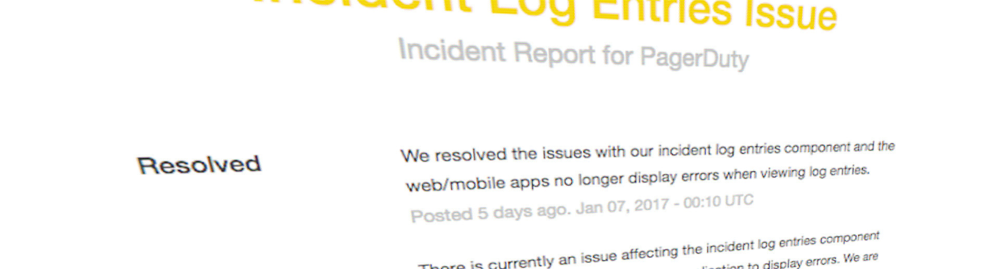

So you want to be a Customer Liaison? You've come to the right place!

## Purpose
The purpose of the Customer Liaison is to be the primary individual in charge of notifying our customers of the current conditions, and informing the Incident Commander of any relevant feedback from customers as the incident progresses.

It's important for the rest of the command staff to be able to focus on the problem at hand, rather than worrying about crafting messages to customers.

Your job as Customer Liaison is to listen to the call, watch the incident Slack room, and track incoming customer support requests, keeping track of what's going on and how far the incident is progressing (still investigating vs close to resolution). The Incident Commander will instruct you to notify customers of the incident and keep them updated at various points throughout the call. You will be required to craft the message, gain approval from the IC, and then disseminate that message to customers.

## Prerequisites
Before you can be a Customer Liaison, it is expected that you meet the following criteria. Don't worry if you don't meet them all yet, you can still continue with training!

* Excellent verbal and written **communication skills**.
* Be a member of the **Customer Support team**, or have had customer support training.

## Responsibilities
Read up on our [Different Roles for Incidents](/before/different_roles.md) to see what is expected from a Customer Liaison, as well as what we expect from the other roles you'll be interacting with.

## Training Process
There is no formal training process for this role, you should feel free to contact our Customer Support team to learn more.

## Customer Liaison
The objective of a Customer Liaison is to keep our customers informed during an incident as to what is happening, and to act as a voice for our customers to the Incident Commander. It is important for customers to have visibility into how they are impacted by an incident we are having, and to have insight into the fact that the problem is actively being worked on. Crafting a public message for customers is tricky, especially on platforms such as Twitter where the number of characters you can use are limited. But here are some general tips for crafting a public message,

* Prepare a default message in advance.
    * One that can be used for the initial update if the scope of the issue is unknown.
* Be honest.
    * Never lie, and never guess. Work with the incident commander if you are unsure as to what is actually happening.
    * Provide transparent information to customers. If we are dropping the ball, be upfront about it.
* Describe our progress in resolving the incident.
    * _"We are aware of an incident..."_
    * _"We are investigating delayed notifications..."_
    * _"A fix has been applied and is currently being deployed..."_
    * _"The issue has been resolved..."_
* Be clear about how the incident is affecting customers. This is the primary piece of information customers will care about.
    * Are notifications delayed? Is the website loading slowly but still working?
* Provide any workarounds customers can use until the incident is resolved.
* &#x2718; Don't estimate resolution times.
    * Never say something like _"We expect this incident to be resolved in 10 minutes"_. Something else could happen, and customers get angry when you set an expectation you can't keep.
* &#x2718; Don't provide **too much** detail.
    * Customers don't care if `application-server-123` is having issues, they care that they are not getting notifications. Make sure the information you provide is relevant and not just noise.

## Incident Call Procedures and Lingo
The [Steps for Customer Liaison](/during/during_an_incident.md) provide a detailed description of what you should be doing during an incident.

Here are some examples of phrases and patterns you should use during incident calls.

### Gaining Message Approval
After you have crafted the public message, you should gain approval from the IC before posting it publicly. Simply copy the message into Slack and wait for verbal/written confirmation from the IC before proceeding.

> (You) Message for customers: "We are currently experiencing delayed notifications and are actively investigating the issue."

> (IC): Looks good, go ahead and post.

It's important to get sign-off from the IC before posting as the nature of the incident may have changed while you were crafting the message, and new information might now be known and need to be included.

### Notification of Customer Response
You may be receiving calls and emails from customers during the incident. This provides useful context for the Incident Commander, as it gives an indication of the scope of the incident. You should keep the IC apprised of any relevant information from customers.

> We've had 6 customers call so far and say they haven't received notifications for the last several minutes.

This can provide the IC with information which affects which areas we investigate first, or an indication of how the incident is progressing.
