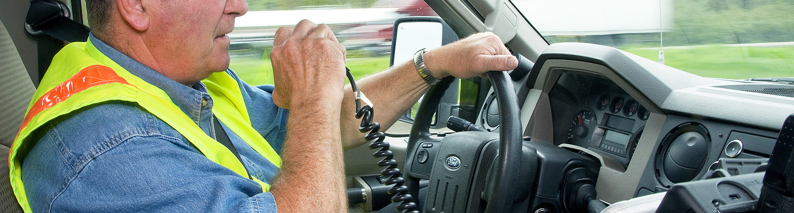

So you want to be a deputy? You've come to the right place!

*Credit: [oregondot @ Flickr](https://www.flickr.com/photos/oregondot/8743801731/in/album-72157633494644719/)*

## Purpose
The purpose of the Deputy is to support the IC by keeping track of timers, notifying the IC of important information, and paging other people as directed by the IC.

It's important for the IC to focus on the problem at hand, rather than worrying about monitoring timers. The deputy is there to help support the IC and keep them focussed on the incident.

As a Deputy, you will be expected to take over command from the IC if they request it.

**You should not be performing any remediations, checking graphs, or investigating logs**. Those tasks will be delegated to the resolvers by the IC.

## Prerequisites
Before you can be a Deputy, it is expected that you meet the following criteria. Don't worry if you don't meet them all yet, you can still continue with training!

* Be trained as an [Incident Commander](/training/incident_commander.md).

## Responsibilities
Read up on our [Different Roles for Incidents](/before/different_roles.md) to see what is expected from a Deputy, as well as what we expect from the other roles you'll be interacting with.

## Training Process
The training process for a Deputy is quite simple.

* Follow our [Incident Commander Training](/training/incident_commander.md).
* Read this page.

## Incident Call Procedures and Lingo
The [Steps for Deputy](/during/during_an_incident.md) provide a detailed description of what you should be doing during an incident.

Here are some examples of phrases and patterns you should use during incident calls.

### Keep Track of Responders
As you listen to the call, you should keep track of the responders to the call as you hear them speak. Make a note on a piece of paper, or use the `!ic responders` to see who they are. The IC may ask you who is on-call for a particular system, and you should know the answer, and be able to page them.

> Do we have a representative from [X] on the call?

> (pause)

> Deputy, can you go ahead and page the [X] on-call please.

You can page them however you see fit, phone call, etc.

### Provide Executive Status Updates
Provide regular status updates on Slack (roughly every 30mins), giving an executive summary of the current status during SEV-1 incidents. Keep it short and to the point, and use @here. Mention the current state, the actions in progress, customer impact, and expected time remaining. It's OK to miss out some of those if the information isn't known.

> @here: We are in SEV-1 due to X. Current actions in progress are to do Y. Expecting 3 mins to complete that action. Once action is complete, system should recover on its own within 5 minutes.

### Alert IC to Timers
You are expected to keep track of how long the incident has been running for, and provide callouts to the IC every 10 minutes so they can take actions such as increasing the severity, or asking Support to Tweet out. This is as simple as telling the IC on the call,

> IC, be advised the incident is now at the 10 minute mark.

Similarly, when the IC asks for someone to get back to them in X minutes, you are expected to keep track of that. You should remind the IC when that time has been reached.

> IC, be advised the timer for [TEAM]'s investigation is up.
