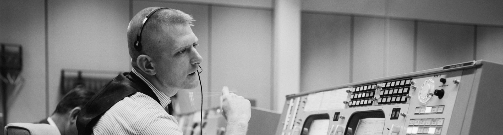

*Credit: [NASA](https://en.wikipedia.org/wiki/File:Eugene_F._Kranz_at_his_console_at_the_NASA_Mission_Control_Center.jpg)*

So you want to be an Incident Commander (IC)? You've come to the right place! You don't need to be a senior team member to become an IC, anyone can do it providing you have the requisite knowledge (yes, even an intern)!

## Purpose
If you could boil down the purpose of an Incident Commander to one sentence, it would be,

> Keep the incident moving towards resolution.

The Incident Commander is the decision maker during an major incident; Delegating tasks and listening to input from subject matter experts in order to bring the incident to resolution. They become the highest ranking individual on any major incident call, regardless of their day-to-day rank. Their decisions made as commander are final.

Your job as an Incident Commander is to listen to the call and to watch the incident Slack room in order to provide clear coordination, recruiting others to gather context/details. **You should not be performing any actions or remediations, checking graphs, or investigating logs.** Those tasks should be delegated.

An IC should also be considering next steps and backup plans at every opportunity, in an effort avoid getting stuck without any clear options to proceed, and to keep things moving towards resolution.

## Prerequisites
Before you can be an Incident Commander, it is expected that you meet the following criteria. Don't worry if you don't meet them all yet, you can still continue with training!

* Excellent verbal and written **communication skills**.
* Has **high-level knowledge** of how the different PagerDuty services interact with each other.
* Ability to size-up a situation, **assess the effectiveness** of various tactics/strategies, and **make rapid decisions** on appropriate courses of action.
* Has flexibility, and is able to **listen to expert feedback**, modifying plans on-the-fly as necessary.
* Has been **involved in at least two major incident responses**, either as a spectator, or as an active participant.
* Has gravitas, **takes command**, and is **willing to kick people off a call** to remove distractions, even if it's the CEO.

!!!tip "Deep technical knowledge not required!"
    [Incident Commanders do not require deep technical knowledge of our systems](../resources/anti_patterns.md#requiring-incident-commanders-to-have-deep-technical-knowledge). Your job as Incident Commander is to coordinate the response, not make technical changes. Don’t think you can’t be an Incident Commander just because you’re not in the engineering department!

## Responsibilities
Read up on our [Different Roles for Incidents](/before/different_roles.md) to see what is expected from an Incident Commander, as well as what we expect from the other roles you'll be interacting with.

## Training Process
The process is fairly loose for now. Here's a list of things you can do to train though,

* Read the rest of this page, particularly the sections below.

* Participate in [Failure Friday](https://www.pagerduty.com/blog/failure-friday-at-pagerduty/) (FF).
    * Shadow a FF to see how it's run.
    * Be the scribe for multiple FF's.
    * Be the incident commander for multiple FF's.

* Play a game of "[Keep Talking and Nobody Explodes](http://www.keeptalkinggame.com/)" with other people in the office.
    * For a more realistic experience, play it with someone in a different office over Hangouts.

* Shadow a current incident commander for at least a full week shift.
    * Get alerted when they do, join in on the same calls.
    * Sit in on an active incident call, follow along with the chat, and follow along with what the Incident Commander is doing.
    * **Do not actively participate in the call, keep your questions until the end.**

* Reverse shadow a current incident commander for at least a full week shift.
    * You should be the one to respond to incidents, and you will take point on calls, however the current IC will be there to take over should you not know how to proceed.

## Graduation
What's the difference between an IC in training, and an IC? (This isn't the set up to a joke). Simple, an IC puts themselves on the schedules.

Also, don't forget to announce yourself in the IC Slack channel, and get yourself added to our IC mailing list.

## Handling Incidents
Every incident is different (we're hopefully not repeating the same issue multiple times!), but there's a common process you can apply to each one. The language used in each step is discussed in more detail in the "Procedures and Lingo" section below.

### Size-Up
_Sizing-up involves getting an idea of what's going on, and how much impact it's having. This is an information gathering step that will allow you to make good decisions later._

1. **Identify the symptoms. _- Ask "What's wrong?"_**
    * Identify what the symptoms are, ask your experts to provide this information.
    * Gather as much information as you can, as quickly as you can (remember the incident is still happening while you're doing this).

1. **Identify scope of incident. _- Ask "Is this affecting multiple services?"_**
    * Identify how big the issue is, and whether it's escalating/flapping/static.
    * Get the facts, the possibilities of what can happen, and the probability of those things happening.

### Stabilize
_Next step is to stabilize the incident. We need to determine what we can do to fix it, and then execute those actions._

1. **Identify possible actions. _- Ask "What actions can we take? How risky are they?"_**
    * Identify any actions you can take to alleviate the issue. Ask your experts what they want to do.
    * Identify the risks associated with each of those actions.

1. **Make a decision. _- Say "We're proceeding with..."_**
    * Decide which action to take based on the information you have available.
    * Making the "wrong" decision is better than making no decision. If you have nothing but bad options, pick one and proceed.

1. **Gain consensus. _- Ask "Are there any strong objections?"_**
    * Gather support for the plan (See "Polling During a Decision" below).
    * Listen for objections.
    * Be prepared to adjust your plan if new information is presented.

1. **Assign task. _- Say "A, please perform B, I'll come back to you in X minutes. Understood?"_**
    * Delegate remediation actions to your SME's.
    * Tasks should be assigned to an individual and be time-boxed.
    * Get acknowledgement that the task was understood and is being executed.

### Update
_While remediation steps are being carried out, it's important to provide status updates, not just to responders, but other stakeholders within the organization._

1. **Provide regular updates. _- Say "Here's a status update: ..."_**
    * Maintain a cadence, and provide regular updates to everyone on the call.
    * What's happening, what are we doing about it, etc.
    * Keep updates short and factual.

### Verify
_Once remediation actions have been performed, we need to verify that they have been successful or not, and proceed with a backup plan if not._

1. **Follow-up on task completion. _- Ask "Have you finished?"_**
    * Ask for the status of task completion from the tasks you assigned out.
    * If responders need more time, give them more time.
    * If problems persist, begin again from the size-up step.

## Deputy
The deputy for an incident is generally the backup Incident Commander. However, as an Incident Commander, you may appoint one or more Deputies. Note that Deputy Incident Commanders must be as qualified as the Incident Commander, and that if a Deputy is assigned, he or she must be fully qualified to assume the Incident Commander’s position if required.

## Communication Responsibilities
Sharing information during an incident is a critical process. As an Incident Commander (or Deputy), you should be prepared to brief others as necessary. You will also be required to communicate your intentions and decisions clearly so that there is no ambiguity in your commands.

When given information from a responder, you should clearly acknowledge that you have received and understood their message, so that the responder can be confident in moving on to other tasks.

After an incident, you should communicate with other training Incident Commanders on any debrief actions you feel are necessary.

!!!info "Clear is better than concise."
    Remember that clear communication is better than concise communication. It can be tempting to try and abbreviate or rush speech in order to speed up the response. This can lead to confusion and misunderstandings which will ultimate increase the response time. Always favour clear communication, even if takes a little bit longer.

## Incident Call Procedures and Lingo
The [Steps for Incident Commander](/during/during_an_incident.md) provide a detailed description of what you should be doing during an incident.

Additionally, aside from following the [usual incident call etiquette](/before/call_etiquette.md), there a few extra etiquette guidelines you should follow as IC:

* Always announce when you join the call if you are the on-call IC.
* Don't let discussions get out of hand. Keep conversations short.
* Note objections from others, but your call is final.
* If anyone is being actively disruptive to your call, kick them off.
* Announce the end of the call.

Here are some examples of phrases and patterns you should use during incident calls.

### Start of Call Announcement
At the start of any major incident call, the incident commander should announce the following,

> This is [NAME], I am the Incident Commander for this call.

This establishes to everyone on the call what your name is, and that you are now the commander. Identify yourself by name and state that you are the "Incident Commander" and not "IC", as newcomers may not be familiar with the terminology yet. The word "commander" makes it very clear that you're in charge.

### Start of Incident, IC Not Present
If you are trained to be an IC and have joined a call, even if you aren't the IC on-call, you should do the following,

> Is there an IC on the call?

> (pause)

> Hearing no response, this is [NAME], and I am now the Incident Commander for this call.

If the on-call IC joins later, you may hand over to them at your discretion (see below for the hand-off procedure)

### Checking if SME's are Present
During a call, you will want to know who is available from the various teams in order to resolve the incident. Etiquette dictates that people should announce themselves, but sometimes you may be joining late to the call. If you need a representative from a team, just ask on the call. Your deputy can page one if no one answers.

> Do we have a representative from [X] on the call?

> (pause)

> Deputy, can you go ahead and page the [X] on-call please.

### Assigning Tasks
When you need to give out an assignment or task, you should follow these three steps,

1. Assign the task to a specific person directly.
1. Time-box the task with a specific number of minutes.
1. Confirm that the responder has acknowledged and understood the instructions.

!!!warning "Can someone..."
    Never say "Can someone..." as this leads to the [bystander effect](https://en.wikipedia.org/wiki/Bystander_effect). Tasks should always be assigned directly to an individual, and never just thrown out with the hope that someone will pick it up.

> IC: Bob, please investigate the high latency on web app boxes. I'll come back to you for an answer in 3 minutes.

> Bob: Understood

Keep track of how many minutes you assigned, and check in with that person after that time. You can get help from your deputy to help track the timings.

### Gaining Consensus (Polling During a Decision)
If a decision needs to be made, it comes down to the IC. Once the IC makes a decision, it is final. But it's important that no one can come later and object to the plan, saying things like "I knew that would happen". An IC will use very specific language to be sure that doesn't happen, and to gain implicit consensus of everyone on the response.

> The proposal is to [EXPLAIN PROPOSAL]

> Are there any strong objections to this plan?

> (pause)

> Hearing no objects, we are proceeding with this proposal.

If you were to ask "Does everyone agree?", you'd get people speaking over each other, you'd have quiet people not speaking up, etc. Asking for any STRONG objections gives people the chance to object, but only if they feel strongly on the matter. It also means that the information you care about the most (objections to proceeding) are heard loud and clearly.

### Status Updates
It's important to maintain a cadence during a major incident call. Whenever there is a lull in the proceedings, usually because you're waiting for someone to get back to you, you can fill the gap by explaining the current situation and the actions that are outstanding. This makes sure everyone is on the same page.

> While we wait for [X], here's an update of our current situation.

> We are currently in a SEV-1 situation, we believe to be caused by [X]. There's an open question to [Y] who will be getting back to us in 2 minutes. In the meantime, we have Tweeted out that we are experiencing issues. Our next Tweet will be in 10 minutes if the incident is still ongoing at that time.

> Are there any additional actions or proposals from anyone else at this time?

### Reducing Scope
Once you've identified the cause of an incident, you can take some time to reduce the scope of your call. For example, if you've identified that a bad deploy is the cause, there's no need to keep your network engineering responder on the call. Responders will usually appreciate not having to stick around for something that doesn't involve them, especially when it's 3am. Generally, it's best to list out the people you want to remain on the call (rather than listing those that can leave), as this not only re-affirms who is required, but makes sure you won't forget about anyone who can leave.

> Now that we've identified the primary cause and are on the way to recovery, I need the deputy, scribe, support, and site-reliability experts to stay on the call. Everyone else, thanks very much for your response, feel free to drop-off at your discretion.

There's no need to forcibly remove anyone from the call, leave the choice open. Sometimes responders prefer to remain to see how the incident eventually resolves, since they're already awake anyway.

### Spinning Off Sub-Teams
When handling [complex incidents](/before/complex_incidents.md), it will sometimes be necessary to spin off a sub-team (or multiple sub-teams) to investigate specific issues in more detail before reporting back. This is to ensure that you can maintain an effective span of control. To do this, you should assign a team leader, give them a specific task (time-boxed in the usual way), and re-affirm that they are your primary contact and that all communication from their team should come via the leader. Use our pre-defined team names of Alpha, Bravo, and Charlie to avoid confusion when creating the teams.

> IC: Anne, I'd like you to lead a sub-team to investigate the ongoing latency in the web-tier. Please gather your desired team and investigate, get back to me in 20 minutes. All communication from your team should be filtered through you. Use the Alpha team rooms and phone bridge.

> Anne: Understood, I'll get back with an update in 20 minutes.

You do not need to prescribe who their team consists of. Either they will have a pre-existing team structure they can utilize, or they should take the initiative to assemble a team on their own. You should pick your team leaders accordingly.

### Transfer of Command
Transfer of command, involves (as the name suggests) transferring command to another Incident Commander. There are multiple reasons why a transfer of command might take place,

* Commander has become fatigued and is unable to continue.
* Incident complexity changes.
* Change of command is necessary for effectiveness or efficiency.
* Personal emergencies arise (e.g., Incident Commander has a family emergency).

Never feel like you are not doing your job properly by handing over. Handovers are encouraged. In order to handover, out of band from the main call (via Slack for example), notify the other IC that you wish to transfer command. Update them with anything you feel appropriate. Then announce on the call,

> Everyone on the call, be advised, at this time I am handing over command to [X].

The new IC should then announce on the call as if they were joining a new call (see above), so that everyone is aware of the new commander.

Note that the arrival of a more qualified person does NOT necessarily mean a change in incident command.

### End of Call Sign-Off
At the end of an incident, you should announce to everyone on the call that you are ending the call at this time, and provide information on where followup discussion can take place. It's also customary to thank everyone.

> Ok everyone, we're ending the call at this time. Please continue any followup discussion on Slack. Thanks everyone.

## Handling Problems
Things don't always go smoothly on incident response calls, so as an Incident Commander you need to be prepared for instances where the conversation gets derailed, either intentionally or unintentionally. Here are some procedures and lingo you can follow when things get disruptive, in order to get things back on track.

### Maintaining Order
Often times on a call people will be talking over one another, or an argument on the correct way to proceed may break out. As Incident Commander it's important that order is maintained on a call. The Incident Commander has the power to remove someone from the call if necessary (even if it's the CEO). But often times you just need to remind people to speak one at a time. Sometimes the discussion can be healthy even if it starts as an argument, but you shouldn't let it go on for too long.

> (noise)

> Ok everyone, can we all speak one at a time please. So far I'm hearing two options to proceed: 1) [X], 2) [Y].

> Are there any other proposals someone would like to make at this time?

> ...etc

### Getting Straight Answers
You may ask a question as IC and receive an answer that doesn't actually answer your question. This is generally when you ask for a yes/no answer but get a more detailed explanation. This can often times be because the person doesn't understand the call etiquette. But if it continues, you need to take action in order to proceed.

> IC: Is this going to disable the service for everyone?

> SME: Well... for some people it....

> IC: Stop. I need a yes/no answer. Is this going to disable the service for everyone?

> SME: Well... it might not do...

> IC: Stop. I'm going to ask again, and the only two words I want to hear from you are "yes" or "no. If this going to disable the service for everyone?

> SME: Well.. like I was saying..

> IC: Stop. Leave the call. Backup IC can you please page the backup on-call for [service] so that we can get an answer.

### Executive Swoop - Overriding the Incident Commander
> Executive: Ignore the incident commander, do what I say!

This is an extreme example, but illustrates the concept of "Executive Swoop", whereby someone who would be senior to you during peacetime comes on the call and starts overriding your decisions as IC. This is unacceptable behaviour during wartime, as the IC is in command. This is rare, but can cripple the response process if it happens. There is a simple question you can ask as an Incident Commander to get things back on track, "Do you wish to take command?",

> Executive: No, I don't want us doing that. Everyone stop. We need to rollback instead.

> IC: Hold please. [EXECUTIVE], do you wish to take over command?

> Executive: Yes/No

> (If yes) IC: Understood. Everyone on the call, be advised, at this time I am handling over command to [EXECUTIVE]. They are now the incident commander for this call.

> (If no) IC: In that case, please cause no further interruptions or I will remove you from the call.

This makes it clear to the executive that they have the option of being in charge and making decisions, but in order to do so they must continue as an Incident Commander. If they refuse, then remind them that you are in charge and disruptive interruptions will not be tolerated. If they continue, remove them from the call.

### Executive Swoop - Anti-Motiviation
> Executive: Let's try and resolve this in 10 minutes please!

It's rare for an executive to maliciously derail an incident response call, usually it is done with the best of intentions. However, these good intentions can still derail your response process and demotivate responders. As an Incident Commander you will need to recognize and respond to these situations. In the case above, it seems motivational, however it assumes responders aren't already working as hard as possible to solve the problem, and adds no value to the response process. You can respond to this by reminding the commenter that these things should be kept until after the incident is over.

> IC: We're in the middle of an incident, please keep your comments until the end.

### Executive Swoop - Wants Information
> Executive: Can I get a spreadsheet of all affected customers?

The most common case of executive swoop is a request for more information. Unfortunately, when in the middle of an incident, you typically cannot spare the resources to gather such information. As an incident commander you should remind the executive of this, and that the incident takes priority.

> We can either get you that list, or fix the incident. Not both. The incident takes priority.

Note that this isn't phrased as a question, you've already made the decision as Incident Commander, you're just informing the executive of that decision.

### Executive Swoop - Questioning Severity
> Executive: Is this really a SEV-1?

Our severity levels determine the scale of response we give to an incident. Conversations on what severity an incident is can very quickly consume the entire call and doesn't change the fact that there is an incident on-going. We do not discuss incident severity during an incident call, as we treat an incident as the highest severity we think it could be. We can downgrade the severity during the post-mortem, however we cannot waste time litigating severities on an incident call. So simply remind folks of this in order to get things back on track,

> IC: We do not discuss incident severity during the call. We're treating this as a SEV-1.

### The Belligerent Responder
Sometimes you will have a responder who does not follow instructions and/or is being actively disruptive to your response call. Perhaps this is being done intentionally, or it could even be unintentional (an un-muted microphone while in a loud environment, etc). In either case, you need to resolve the situation and get back to the incident at hand. State the fact that the individual is being disruptive, provide them a way to save face, but also state what will happen if they don't stop. No second chances, if they don't follow through, remove them from the call.

> You're being disruptive. Please stop, or I will have to remove you from the call.

## Examples From Pop Culture
PagerDuty employees have access to all previous incident calls, and can listen to them at their discretion. We can't release these calls, so for everyone else, here are some short examples from popular culture to show the techniques at work.

---

<iframe width="560" height="315" src="https://www.youtube.com/embed/XLMDSjCzEx8" frameborder="0" allowfullscreen></iframe>
Here's a clip from the movie Apollo 13, where Gene Kranz (Flight Director / Incident Commander) shows some great examples of Incident Command. Here are some things to note:

* Walks into the room, and immediately obvious that he's the IC. Calms the noise, and makes sure everyone is paying attention.
* Provides a status update so people are aware of the situation.
* Projector breaks, doesn't get sidetracked on fixing it, just moves on to something else.
* Provides a proposal for how to proceed and elicits feedback.
    * Listens to the feedback calmly.
    * When counter-proposal is raised, states that he agrees and why.
* Allows a discussion to happen, listens to all points. When discussion gets out of hand, re-asserts command of the situation.
    * Explains his decision, and why.
* Explains his full plan and decision, so everyone is on the same page.

---

<iframe width="560" height="315" src="https://www.youtube.com/embed/Tid44iy6Rjs" frameborder="0" allowfullscreen></iframe>
Another clip from Apollo 13. Things to note:

* Summarizes the situation, and states the facts.
* Listens to the feedback from various people.
* When a trusted SME provides information counter to what everyone else is saying, asks for additional clarification ("What do you mean, everything?")
* Wise cracking remarks are not acknowledged by the IC ("You can't run a vacuum cleaner on 12 amps!")
* "That's the deal?".. "That's the deal".
* Once decision is made, moves on to the next discussion.
* Delegates tasks.
