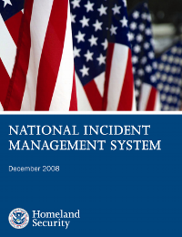
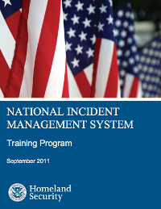

Learning about the PagerDuty major incident response process is an important part of being an effective on-call engineer at PagerDuty. This section goes over our training material for the various roles that are involved in our incident response, along with some additional information and training material from government agencies.

## Training Guides
Our training guides are split up by role, however you are encouraged to read through the training guides even for roles you don't belong to, as it can give you some good insight into how those people will be behaving during major incidents.

* [Incident Commander Training](/training/incident_commander.md) - The "IC" is the person who drives a major incident to resolution. They're the person who will be directing everyone else.
* [Deputy Training](/training/deputy.md) - The Deputy is someone who supports the Incident Commander and can take over for them if necessary.
* [Scribe Training](/training/scribe.md) - This is intended for individuals who will be acting as a scribe during an incident.
* [SME / Resolver Training](/training/subject_matter_expert.md) - This is relevant to everyone at PagerDuty who are on-call for any team.
* [Customer Liaison Training](/training/customer_liaison.md) - This is for individuals who will be publicly representing us and interacting with customers.

## National Incident Management System (NIMS)
Our incident response process is loosely based on the [US National Incident Management System (NIMS)](https://www.fema.gov/national-incident-management-system), which is described as,

  _A systematic, proactive approach to guide departments and agencies at all levels of government, nongovernmental organizations, and the private sector to work together seamlessly and manage incidents involving all threats and hazards—regardless of cause, size, location, or complexity—in order to reduce loss of life, property and harm to the environment._

While it might not initially seem that this would be applicable to an IT operations environment, we've found that many of the lessons learned from major incidents in these situations can be directly applied to our industry too. The principles are the same and span many different environments.

 

If you want to learn more about NIMS, we recommend the [ICS-100](https://training.fema.gov/is/courseoverview.aspx?code=IS-100.b) and [ICS-700](https://training.fema.gov/is/courseoverview.aspx?code=IS-700.a) online training courses, which go over NIMS and the Incident Command System (You can also take an online examination after training in order to get a certificate from FEMA). There is also a wealth of [additional training material and courses from FEMA](https://training.fema.gov/nims/) on NIMS, which I would encourage you to look at.

If you're based in the US and interested in taking a more active incident response role in your community, we recommend investigating your local [CERT programs](https://www.fema.gov/community-emergency-response-teams) (Community Emergency Response Teams). Many cities offer CERT training, after which you can volunteer as a CERT contributor within your community. Not only is it an opportunity to get real world experience with disaster response, but the skills you learn can be applied to everyday life too.

Also take a look at the [Additional Reading](/#additional-reading) section on the home page.
