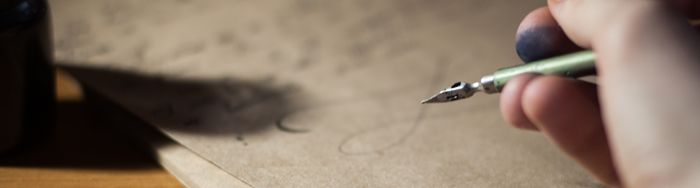

*Credit: [John-Mark Smith](https://www.pexels.com/photo/person-holding-fountain-pen-211291/)*

So you want to be a Scribe? You've come to the right place! You don't need to be a senior team member to become a Deputy or Scribe, anyone can do it providing you have the requisite knowledge!

## Purpose
The purpose of the Scribe is to maintain a timeline of key events during an incident. Documenting actions, and keeping track of any follow-up items that will need to be addressed.

It's important for the rest of the command staff to be able to focus on the problem at hand, rather than worrying about documenting the steps.

Your job as Scribe is to listen to the call and to watch the incident Slack room, keeping track of context and actions that need to be performed, documenting these in Slack as you go. **You should not be performing any remediations, checking graphs, or investigating logs.** Those tasks will be delegated to the subject matter experts (SME's) by the Incident Commander.

## Prerequisites
Before you can be a Scribe, it is expected that you meet the following criteria. Don't worry if you don't meet them all yet, you can still continue with training!

* Excellent verbal and written **communication skills**.

## Responsibilities
Read up on our [Different Roles for Incidents](/before/different_roles.md) to see what is expected from a Scribe, as well as what we expect from the other roles you'll be interacting with.

## Training Process
There is no formal training process for this role, reading this page should be sufficient for most tasks. Here's a list of things you can do to train though,

* Read the rest of this page, particularly the sections below.

* Participate in [Failure Friday](https://www.pagerduty.com/blog/failure-friday-at-pagerduty/) (FF).
    * Shadow a FF to see how it's run.
    * Be the Scribe for multiple FF's.

## Scribing
Scribing is more art than science. The objective is to keep an accurate record of important events that occurred on the call, so that we can look back at the timeline to see what happened. But what exactly is important? There's no overwhelming answer, and it really comes down the judgement and experience. But here are some general things you most definitely want to capture as Scribe.

* The result of any polling decisions.
    * &#x2718; This is not "9 people voted yay, 3 voted nay".
    * &#x2713; It is "Polled for if we should do rolling restart. <USER_A> is proceeding with restart."
* Any follow-up items that are called out as "We should do this..", "Why didn't this?..", etc.
    * &#x2718; This is not "Why isn't the Support representative on the call?"
    * &#x2713; This is "TODO: Why didn't we get paged for this earlier?"

## Incident Call Procedures and Lingo
The [Steps for Scribe](/during/during_an_incident.md) provide a detailed description of what you should be doing during an incident.

Here are some examples of phrases and patterns you should use during incident calls.

### Status Stalking
At the start of any major incident call, you should start our status stalking bot, so that it will post to the room an update automatically.

> !status stalk

This will provide the update and allow the IC to see the status without having to keep asking.

### Note Important Actions
During a call, you will hear lots of discussion happening, you should not be documenting all of this in the chat room. You only want to document things which will be important for the final timeline. It's not always obvious what this might be, and it's usually a matter of judgement. You generally want to note any actions the IC has asked someone to perform, along with the result of any polling decisions.

> Polled for decision on whether to perform rolling restart. We are proceeding with restart. [USER_A] to execute.

Some actions might seem important at the time, but end up not being. That's OK. It's better to have more info than not enough, but don't go overboard.

### Note Follow-up Actions
Sometimes during the call, someone will either mention something we "should fix", or the IC will specifically ask you to note a followup item. You can do this in Slack by simply prefixing with "TODO", this will make it easier to search for later.

> TODO: Why did we not get paged for the fall in traffic on [X] cluster?

The postmortem owner will find these after and raise tasks for them.

### End of Call Notification
When the IC ends the call, you should post a message into Slack to let everyone know the call is over, and that they should continue discussion elsewhere.

> Call is over, thanks everyone. Follow up in Slack.

Don't forget to also stop the status stalking.

> !status unstalk
