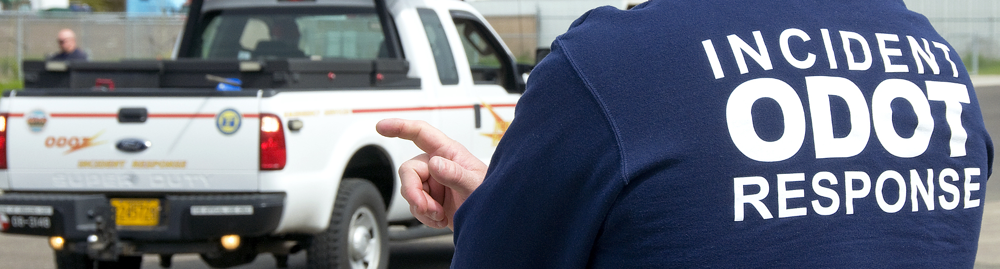

*Credit: [oregondot @ Flickr](https://www.flickr.com/photos/oregondot/8743809853/in/album-72157633494644719/)*

If you are on-call for any team at PagerDuty, you may be paged for a major incident and will be expected to respond as a subject matter expert (SME) for your service. This page details everything you need to know in order to be prepared for that responsibility. If you are interested in becoming an Incident Commander, take a look at the [Incident Commander Training page](/training/incident_commander.md).

## On-Call Expectations
If you are on-call for your team, there are certain expectations of you as that on-call. This applies to both the primary and secondary on-calls. Getting paged about a SEV-3 or SEV-4 in your system comes with different expectations than getting paged with a major SEV-2.

### Before Going On-Call

1. Be prepared, by having already familiarized yourself with our incident response policies and procedures. In particular,
    1. [Different Roles for Incidents](/before/different_roles.md) - You will be acting as a "Resolver" or "SME". But you should familiarize yourself with the other roles and what they will be doing.
    1. [Incident Call Etiquette](/before/call_etiquette.md) - How to behave during an incident call.
    1. [During an Incident](/during/during_an_incident.md) - What to do during an incident. You are specifically interested in the "Resolver" steps, but you should familiarize yourself with the entire document.
    1. [Glossary](/training/glossary.md) - Familiarize yourself with the terminology that may be used during the call.
1. Make sure you have set up your alerting methods, and that PagerDuty can [bypass your "Do Not Disturb" settings](https://support.pagerduty.com/docs/notification-phone-numbers).
1. Check you can join the incident call. You may need to install a browser plugin. You don't want to be doing that the first time you get paged.
1. Be aware of your upcoming on-call time and arrange swaps around travel, vacations, appointments, etc.
1. If you are an Incident Commander, make sure you are not on-call for your team at the same time as being on-call as Incident Commander.

### During On-Call Period

1. Have your laptop and Internet with you at all times during your on-call period (office, home, a MiFi, a phone with a tethering plan, etc).
1. If you have important appointments, you need to get someone else on your team to cover that time slot in advance.
1. When you receive an alert for a major incident, you are expected to join the incident call and Slack as quickly as possible (within minutes).
    1. You will be asked questions or given actions by the Incident Commander. Answer questions concisely, and follow all actions given (even if you disagree with them).

## Response Mobilization
When an incident occurs, you must be mobilized or assigned to become part of the incident response. In other words, until you are mobilized to the incident via a page or being directly asked by someone else on the incident, you remain in your everyday role. After being mobilized, your first task is to check in and receive an assignment. While it's tempting to see an incident happening and want to jump in and help, when resources show up that have not been requested, the management of the incident can be compromised.

## "Never Hesitate to Escalate"
If you're not sure about something, it is perfectly acceptable to bring in other SMEs from your team that you believe know a given system better than you. Don't let your ego keep you from bringing in additional help. Our motto is "Never hesitate to escalate", you will never be looked down upon for escalating something because you didn't know how to handle it.

## Blameless
There will be incidents. Some will be caused by you, some will be caused by others... some will just happen. Our entire incident response process is completely blameless. Blaming people is counter productive and just distracts from the problem at hand. No matter how an incident started, they all need to get solved as quickly as possible.

## Wartime vs Peacetime
Behavior during a major incident is very different to any other alert you may have received in the past. We call a major incident "wartime", and make a distinction between that and normal everyday operations ("peacetime").

### Peacetime
The organizational structure is generally based on seniority. The more senior members of a team will lead discussions, and managers or team leads will have the final say. Decisions are made after careful consideration of all options, and to minimize potential risk to customers.

### Wartime
Wartime is different, and you will notice on our major incident calls that there's a different organizational structure.

* The Incident Commander is in charge. No matter their rank during peacetime, they are now the highest ranked individual on the call, higher than the CEO.
* Primary responders (folks acting as primary on-call for a team/service) are the highest ranked individuals for that service.
* Decisions will be made by the IC after consideration of the information presented. Once that decision is made, it is final.
* Riskier decisions can be made by the IC than would normally be considered during peacetime.
    * For example, the IC may decide to drop events for a particular customer in order to maintain the integrity of the system for everyone else.
* The IC may go against a consensus decision. If a poll is done, and 9/10 people agree but 1 disagrees. The IC may choose the disagreement option despite a majority vote.
    * Even if you disagree, the IC's decision is final. During the call is not the time to argue with them.
* The IC may use language or behave in a way you find rude. This is wartime, and they need to do whatever it takes to resolve the situation, so sometimes rudeness occurs. This is never anything personal, and something you should be prepared to experience if you've never been in a wartime situation before.
* You may be asked to leave the call by the IC, or you may even be forceable kicked off a call. It is at the IC's discretion to do this if they feel you are not providing useful input. Again, this is nothing personal and you should remember that wartime is different than peacetime.
